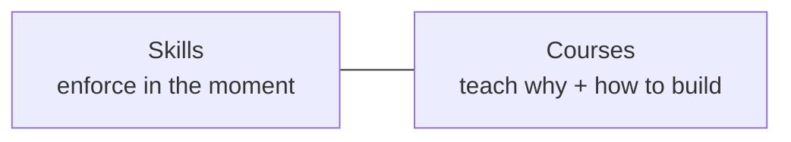

# Courses

Mechanisms for working with AI without becoming confidently wrong.

Skills in this repo block bad paths while you work. Courses teach the failure modes those skills exist for — and how to wire the same standards into your own systems.

| Course | Days | Arc |
|--------|------|-----|
| [Make AI Fail Safely](./make-ai-fail-safely/) | 30 | Failures → guardrails → evals → production → capstone |

---

## Design bar

A day ships here only if it has all four:

| # | Requirement | Anti-pattern |
|---|-------------|--------------|
| 1 | Names a **specific failure** | Mood, slogan, vibe |
| 2 | Explains the **mechanism** | Recycled tips, hypotheticals |
| 3 | Gives a **10-min exercise** that makes failure or fix visible | "Think about it" |
| 4 | Leaves an **enforceable standard** | Pep talk, disclaimer |

> **Rule:** "Be careful with AI" fails the bar. "Here's the mechanism that lets wrong answers feel finished" passes.
