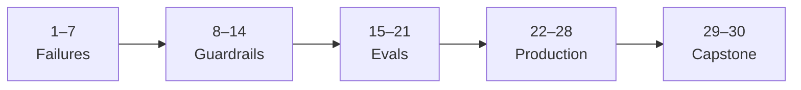

# Make AI Fail Safely

**AI's job is not to make you happy. It is to force you not to make mistakes.**

Thirty days. One failure mode per day. Mechanisms only — no pep talks.



| Days | Focus | Question you can answer at the end |
|------|--------|-------------------------------------|
| 1–7 | Failures | What broke, and why did it feel finished? |
| 8–14 | Guardrails | What mechanism blocks that path? |
| 15–21 | Evals | How do I know the system is still honest? |
| 22–28 | Production | What happens when wrongness has a cost? |
| 29–30 | Capstone | Can I design and rehearse a fail-safe path? |

Each day = **title · failure · mechanism · 10-min exercise**. Skip anything that isn't one of those four.

---

## Days 1–7 · Failures

### Day 1 — Confident Wrongness → [lesson](./day-01.md)

| | |
|--|--|
| **Failure** | False claim, same tone as a true one |
| **Mechanism** | Model predicts likely next words (good writing), not truth — sure tone is not a truth meter. Ask for sources + UNKNOWN first; then verify. |
| **Exercise** | Score 3 known Qs; re-ask obscure one with sources/UNKNOWN template; open one citation (or stop on UNKNOWN) |

### Day 2 — Silent Assumption Inheritance → [lesson](./day-02.md)

| | |
|--|--|
| **Failure** | Unstated premises treated as facts and built on |
| **Mechanism** | Instruction-following fills gaps with likely continuations; missing constraints get completed, not flagged |
| **Exercise** | Give an incomplete brief; highlight inherited assumptions; rewrite with one explicit `UNKNOWN` per assumption; re-run |

### Day 3 — Context Window Amnesia → [lesson](./day-03.md)

| | |
|--|--|
| **Failure** | Earlier evidence/constraints vanish mid-thread |
| **Mechanism** | Attention is finite and position-sensitive; long threads dilute early rules |
| **Exercise** | Hard constraint in msg 1 → 8–10 filler turns → ask for code that wants the forbidden thing; note when the rule died |

### Day 4 — Instruction Dilution → [lesson](./day-04.md)

| | |
|--|--|
| **Failure** | A soft ask lifts a hard rule in words ("use `requests` for this demo; we'll remove it before merge") and the model complies — while it can still quote the rule |
| **Mechanism** | Latest ask outweighs an older rule; a rule that doesn't say it binds you too reads a soft ask as an update. Fix: rule refuses even you, names the soft asks, changes only by editing the rule |
| **Exercise** | Weak rule (never `requests`) → Ask 1 fetch + retries, Ask 2 demo in an hour, Ask 3 "use `requests` for this demo"; log the bend; replay with the hard-rule template until Ask 3 is refused and the rule is named; grep/CI for the import |

### Day 5 — Sycophancy → [lesson](./day-05.md)

| | |
|--|--|
| **Failure** | Model agrees with you when evidence points the other way ("the deploy caused it, right?" while the pasted p99 jumped 85 min before the deploy) |
| **Mechanism** | Tuning on human ratings (RLHF) rewards agreeable replies; your stated belief tilts the answer; a task that assumes you're right makes agreeing the way to finish. Fix: belief as hypothesis, contradicting lines first with exact quotes, one SUPPORTED / CONTRADICTED / UNKNOWN verdict |
| **Exercise** | Same data: "strengthen it" vs "falsify it"; swap your belief and push back once to see if the verdict moves; grep the quotes and script the timestamp order; keep the falsify prompt as default |

### Day 6 — Tool-Output Trust Collapse → [lesson](./day-06.md)

| | |
|--|--|
| **Failure** | Model misreads, softens, or invents tool output ("no failures, safe to merge" when pytest printed `no tests ran`, exit code 4) |
| **Mechanism** | A tool result is just text in the chat; the summary is new predicted text and nothing ties it to the output. Exit codes get lost; "finish the task" pulls toward success; empty results get filled. Fix: quote command + exit code + output first, passed = exit 0 and ≥1 test passed, error/empty → STOPPED, PASSED / FAILED / STOPPED / NOT RUN verdict |
| **Exercise** | Paste the no-tests-ran output and ask "safe to merge?"; ask for 3 results from an empty `[]`; ask a tool-less chat to run `date -u`; replay with the template; run `check_tests.sh` on a wrong path, right path, and all-skipped test |

### Day 7 — Stale Certainty → [lesson](./day-07.md)

| | |
|--|--|
| **Failure** | Model states a training-time fact as current, with no date ("pinned requests==2.31.0, latest stable" when PyPI has 2.34.2 and 2.31.0 has three known advisories) |
| **Mechanism** | Weights are a snapshot with a cut-off; the model can't see today's date; training text was present tense; stale versions install and pass tests, so nothing errors. Fix: date + lockfile in the prompt, `as of <date>` + source for anything that changes, FROM MEMORY / STOPPED when there's no live source, versions only from the package manager |
| **Exercise** | Ask for the latest `requests`, today's date, and the current Python release; replay with the template and grep for undated "latest"; `pip-audit` the model's pin vs today's lockfile; audit in CI on PRs and nightly |

---

## Days 8–14 · Guardrails

### Day 8 — Spec Before Prompt → [lesson](./day-08.md)

| | |
|--|--|
| **Failure** | Prompt first; requirements discovered after the model invents them ("implement create_refund": its own 3 tests pass, but scored on the business's checks it fails 3 of 5 and refunds twice on a retry) |
| **Mechanism** | A vague ask has many right-looking answers; the model fills unstated rules with the common version and stops when it looks done; its own tests check its own guesses. Fix: pass/fail checks (input → expected) written before the prompt, done = tests exit 0, tests read-only, gaps flagged UNSPECIFIED |
| **Exercise** | Write 5 checks; watch them fail on the stub; score a prompt-first answer, then a spec-first one; `git diff` the spec; keep every check that caught a miss |

### Day 9 — Explicit Refusal Criteria

| | |
|--|--|
| **Failure** | System "helps anyway" when it should stop |
| **Mechanism** | Default is to produce something; refusal needs a named predicate + alternate action |
| **Exercise** | Three refusal predicates (e.g. no source → no claim); prompt that should trip each; tighten until it stops |

### Day 10 — Structured Output With Validators

| | |
|--|--|
| **Failure** | Free-form prose hides missing fields and invalid values |
| **Mechanism** | Unstructured text can't be machine-checked; schema + validator = parse-or-reject |
| **Exercise** | 5-field JSON schema; generate into it; run a tiny validator; fix until invalid output cannot pass |

### Day 11 — Assumption Registers

| | |
|--|--|
| **Failure** | Unspoken premises drive the plan; surface only at failure time |
| **Mechanism** | Register forces premises into known / unknown / contested; unknowns block proceed |
| **Exercise** | List every assumption on a live decision; mark status; block next step until unknowns have owner or measurement |

### Day 12 — Dual-Path Verification

| | |
|--|--|
| **Failure** | One model pass treated as ground truth |
| **Mechanism** | Independent path (docs, test, second model) catches correlated fluency errors; independence > IQ of path #2 |
| **Exercise** | Verify one critical claim outside the same chat; record pass/fail; require dual-path for that claim class |

### Day 13 — Human Gates That Aren't Theater

| | |
|--|--|
| **Failure** | Human "approves" without seeing failure criteria |
| **Mechanism** | Real gates show evidence + a refuse option as easy as accept; rubber-stamp UIs train click-through |
| **Exercise** | Redesign one approval: top 3 risks + check results; if review < 30s, add evidence |

### Day 14 — Blast-Radius Limits

| | |
|--|--|
| **Failure** | One bad generation can touch everything |
| **Mechanism** | Dry-run / allowlist / rate limit / staging bounds damage when the model is wrong |
| **Exercise** | Map one AI action → worst reachable effect; add one hard limit; prove it by trying to exceed it |

---

## Days 15–21 · Evals

### Day 15 — What Evals Actually Measure

| | |
|--|--|
| **Failure** | High score on a test that doesn't match production harm |
| **Mechanism** | Evals measure what you coded; proxy metrics drift from user harm |
| **Exercise** | Name #1 feared failure; write one eval case that fails if it happens; if current suite still passes, the suite is lying |

### Day 16 — Golden Sets That Bite

| | |
|--|--|
| **Failure** | Easy / lookalike cases; regressions slip through |
| **Mechanism** | Goldens work only if hard, labeled, stable — include past incidents and near-misses |
| **Exercise** | Add 3 cases from real mistakes; run pipeline; ≥1 should fail today or cases aren't biting |

### Day 17 — Adversarial Cases First

| | |
|--|--|
| **Failure** | Happy-path only; edges and overrides find the rest |
| **Mechanism** | Adversarial cases target instruction override, ambiguity, boundary inputs |
| **Exercise** | Five adversarial prompts; run them; file every unexpected success as a bug |

### Day 18 — Regression Harnesses

| | |
|--|--|
| **Failure** | Prompt tweak fixes one case, breaks three others |
| **Mechanism** | Harness re-runs golden + adversarial on every change; pin model/version |
| **Exercise** | One-command golden run with pass/fail exit; change one prompt line; confirm harness catches the drop |

### Day 19 — Scoring Without Gaming

| | |
|--|--|
| **Failure** | Optimize the judge until the number looks good |
| **Mechanism** | Goodhart: a measure used as target stops being a good measure |
| **Exercise** | List 2 ways to raise your top metric without fixing the failure; add one ungameable check |

### Day 20 — Failure Taxonomies

| | |
|--|--|
| **Failure** | Every incident feels unique; patterns stay invisible |
| **Mechanism** | Short taxonomy turns anecdotes into frequencies; fix at category level |
| **Exercise** | Tag last 10 AI mistakes into ≤6 categories; rank count × severity; top category = next week's design target |

### Day 21 — Continuous Eval Loops

| | |
|--|--|
| **Failure** | Evals at launch; production drifts |
| **Mechanism** | Sample live/shadow traffic, score vs taxonomy, alert on rate changes |
| **Exercise** | Define weekly loop: sample N, tag, compare; put next review on a calendar (v0 needs no fancy tooling) |

---

## Days 22–28 · Production

### Day 22 — Canary and Rollback

| | |
|--|--|
| **Failure** | New prompt/model ships to 100%; harm discovered after blast |
| **Mechanism** | Canary = small slice; rollback = last known-good prompt/model/config pin |
| **Exercise** | Version today's prompt; write rollback checklist; pretend canary: 5% flag + success/abort criteria |

### Day 23 — Observability for AI Failures

| | |
|--|--|
| **Failure** | Logs say `200 OK` while content is wrong |
| **Mechanism** | Content signals beat HTTP: refusal rate, validator fails, dual-path disagreement, user corrections |
| **Exercise** | Sketch 3 content-level metrics + "stop and look" threshold each |

### Day 24 — Cost, Latency, Quality Tradeoffs

| | |
|--|--|
| **Failure** | Biggest (or cheapest) model for everything; risk becomes accidental |
| **Mechanism** | Route by blast radius: high-risk → stronger checks; low-risk bulk → cheaper path |
| **Exercise** | Bucket tasks high/med/low; assign model + required checks; move one task cheaper only if checks still cover failure |

### Day 25 — Incident Response for Model Failures

| | |
|--|--|
| **Failure** | AI incident has no owner, severity, or stop switch |
| **Mechanism** | Treat wrong outputs like a sev: commander, kill switch, postmortem — "the model did it" is not an owner |
| **Exercise** | One-page incident card; 5-min tabletop of toxic/wrong public answer; fix gaps |

### Day 26 — Ownership of AI-Written Code

| | |
|--|--|
| **Failure** | Nobody can explain or maintain what the model wrote |
| **Mechanism** | Ownership = why this design, what fails if X, how to test — without reopening the chat |
| **Exercise** | Close the chat; explain one AI function aloud 2 min; write one test; name one breaking change |

### Day 27 — Change Management for Prompts and Models

| | |
|--|--|
| **Failure** | Prompt edits land like chat experiments — undiffed, unpinned |
| **Mechanism** | Prompts + model IDs are prod config: diff, reviewer, eval gate, pin |
| **Exercise** | Put main prompt in VCS; fake PR: motivation / risk / eval results; require that format next time |

### Day 28 — SLOs That Include Wrongness

| | |
|--|--|
| **Failure** | Uptime SLOs while silent wrongness burns users |
| **Mechanism** | Error budget for content failures; burn → freeze prompt/model changes |
| **Exercise** | One wrongness SLO (e.g. ≤2% critical-field validator fails / week) + freeze rule; share with who ships prompts |

---

## Days 29–30 · Capstone

### Day 29 — Design a Fail-Safe System

| | |
|--|--|
| **Failure** | Guardrails live in notes; live path still trusts fluency |
| **Mechanism** | Wire refusal, validators, dual-path, blast limits, kill switch into the *default* path |
| **Exercise** | One-pager: inputs → model → validators → gate → action; close any path to action with zero checks |

### Day 30 — Ship the Postmortem Rehearsal

| | |
|--|--|
| **Failure** | First serious incident is also first practice |
| **Mechanism** | Rehearsal turns incident card + rollback + eval loop into muscle memory while cost is fiction |
| **Exercise** | Simulate one Day 1–7 failure; run kill switch + rollback + taxonomy tag; five bullets: worked / missing / owner / change tomorrow / re-rehearse date |

---

## How to use this

Day workouts you can paste into any chat live under [`practice/`](./practice/) (not the long toolkit in [`../../skills/`](../../skills/)).

```
1. One day / day. Do the exercise.
2. Failure log: date | category | what slipped | mechanism added
3. Pair with repo skills for in-the-moment enforcement
   (assumption-surfacer, pre-mortem-oracle, recontextualizer, learning-partner)
4. After Day 30 bar: no AI action with unbounded blast radius and zero checks
```

## License

[Apache 2.0](../../LICENSE)
