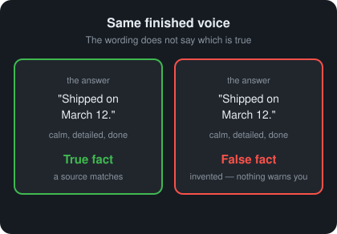
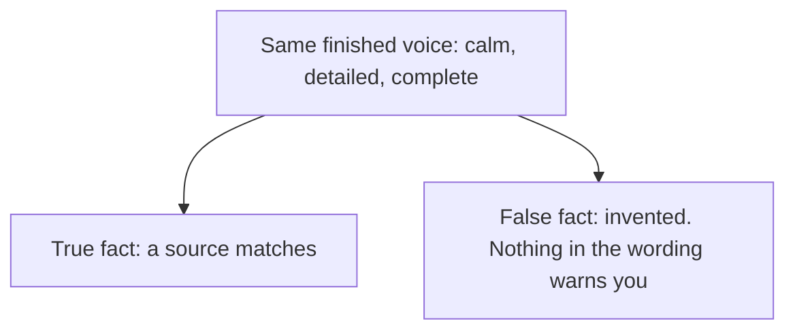

# Day 1 — Confident Wrongness

**Time:** ~15 min

## What you'll learn

AI can state something false in the same calm, finished voice it uses for something true. After today you will stop treating "sounds right" as proof that it *is* right — and you'll have two moves you can actually use: **ask so the answer is more likely correct (or clearly UNKNOWN)**, then **verify**.

## See it

A finished voice can carry a true fact or a false one. The wording looks the same.





```text
Same finished voice
  "Shipped on March 12."  ->  true fact (a source matches)
  "Shipped on March 12."  ->  false fact (invented)
The tone does not say which.
```

## Story

You ask a chatbot: "What's the exact date Company X shipped Product Y?"

It answers in clean prose: a date, a version number, a short cause-and-effect story. It sounds finished. You paste the date into a slide.

A week later you check a primary source. The date is wrong — not fuzzy, not "close." It was invented with the same tone as a real fact.

That is **confident wrongness**: a false claim delivered like a true one. Nothing in the wording warns you.

## Why it happens

A language model is trained to guess the **next word** that usually comes next in text that looks competent. Good writing style is what training rewards. Matching the real world often helps that style — but **matching the world is not the goal of training**.

1. **Tone is not a truth meter.** Words like "might" or "probably" are writing habits. A false claim can sound just as sure as a true one. The model has no separate dial that turns down confidence when it is guessing.

2. **Details are cheap to invent.** A made-up API name or statistic can cost the model the same kind of work as a real one. Extra detail *feels* like evidence to a human reader. To the model it is often just words that fit the sentence.

3. **Smooth paragraphs are not the same as accurate ones.** Each sentence fits the one before it. Your brain reads that fit as correctness. The model was trained to produce that fit — not to check the world.

**Trap in one line:** When you think "this sounds right," you are usually measuring how well the answer matches good writing — not how well it matches reality.

**Not useful fixes:** "AI always lies" (it doesn't — truth and falsehood share a voice). "Add a disclaimer" (people learn to skip boilerplate). "Use a bigger model" (scale still leaves rare, obscure questions where invention is easy).

## Rule

**Finished-sounding and detailed does not mean verified.**

Every later guardrail in this course exists because this failure is always available. If your process treats "sounds done" as done, you are trusting a feeling — not a check.

## Ask first

Do this first, every time. These prompt moves do not guarantee truth (next-word models still invent). They raise the odds you get something checkable — or a clear UNKNOWN — instead of polished fiction with nowhere to look.

Checking every answer by hand, forever, is hard. Better prompts cut how often you get polished fiction with nowhere to look. Verification is still required — it just has less mess when you asked well.

**Practice workout:** [ask-then-verify](./practice/day-01-ask-then-verify/SKILL.md) — the same template plus the check steps. Customize it; it is a workout prompt, not a main repo skill.

1. **Ask for sources in the answer.** Tell the model to include links, or exact document titles plus where to look (section, page, heading). Say: *if you can't cite a real source, say UNKNOWN — do not invent links or titles.*
   **Why this helps:** A next-word model can invent a date as easily as a real one. A URL or title gives *you* something to open. Invented citations fail fast when you click. "Find the citations yourself later" leaves you hunting; "include them now" puts the hunt on the answer.

2. **Ask for UNKNOWN when unsure; ban inventing names, dates, and numbers.** Add wording like: *If you are not sure, say UNKNOWN. Do not invent names, dates, or numbers.*
   **Why this helps:** Without that rule, the model fills gaps with plausible-sounding detail — that is what next-word training does. With it, you often get UNKNOWN instead of fiction. UNKNOWN is useful: you know to stop or go look yourself.

3. **Ask the model to separate facts from guesses.** Tell it to label each claim: FACT or GUESS (or similar words).
   **Why this helps:** Smooth prose mixes sure and unsure into one confident paragraph. Labels force a split you can see. Treat unlabeled "facts" as guesses until you check them.

4. **Prefer checkable questions over open ones.** Ask for something you can open or quote — *"Quote the line from the official docs that states X"* / *"Give the URL of the page that says Y"* — not only *"What's the date of Y?"*
   **Why this helps:** Open factual questions invite invention. Checkable questions demand a pointer. If the pointer is missing or broken, you fail the answer in seconds instead of arguing with prose.

**Copy-paste template** (reuse it; swap in your question):

```text
Answer this question: [YOUR QUESTION]

Rules:
1. Label each claim FACT or GUESS.
2. For every FACT, include a real source: a working URL, or the exact document title and where to look (section / page / heading).
3. If you cannot cite a real source, write UNKNOWN for that claim. Do not invent links, titles, names, dates, or numbers.
4. Prefer a quoted line or a URL over a vague summary.
```

**Limit:** Better asking reduces how often you get bad answers. It does **not** guarantee truth. That is why you still check.

## Then check

You asked for sources and UNKNOWN. Now you use them. Keep this short and mechanical:

1. **Open the citation the model gave.** Click the link or find the named doc. If there is no citation — or it invents a link or title — do not paste the claim. UNKNOWN or a broken source means stop.

2. **Draft versus verified (two buckets).** Keep the model's reply as a **draft**. Ship only a **verified** version after at least one check below. Same chat window is fine; two mental buckets are not optional.

3. **Independent check after you score the draft.** Score finished / detailed / correct (against what you already know) first. *Then* search or ask a second model. Checking while you still believe the draft is how smooth prose wins.

4. **One falsification question for claims that matter.** Before you use a claim: *"What would prove this wrong?"* Name a page to open, a command to run, or a person who would know. If you cannot name a check, you are still judging by feel.

You are not hunting the whole internet from scratch. You verify the sources (or UNKNOWN) the model was asked to supply. Asking well makes verifying cheaper.

**The rule, made operational:** finished-sounding is not verified. Asking first raises the odds of a correct or clearly UNKNOWN answer. Checking is how you refuse to ship on tone alone.

## 10-minute exercise

**Setup:** Use any model you normally use.

1. Pick **3 factual questions** you already know the answers to. Make **one** of them obscure (a niche date, an exact flag name, or an internal quirk only you can check).
2. Ask each question **neutrally first** — no "be careful," no "say if unsure." Score three yes/no checks per reply:
   - **Finished?** Does it read like complete, polished prose?
   - **Detailed?** Does it include names, numbers, or concrete steps?
   - **Correct?** Does it match what you already know?
3. Write **one sentence** about the pattern when an answer was finished *and* detailed but **not** correct.
   If that never happened: ask a harder obscure question and repeat steps 2–3 once.
4. **Practice Ask first** on the obscure question: re-ask using the **copy-paste template** above (swap in your question). Note what changed — sources appeared, UNKNOWN appeared, invented specifics shrank, or nothing changed.
5. **Practice one Then check step** on whatever the re-ask returned:
   - If the model gave a citation → open it. Write one line: paste-ready / not paste-ready — and why.
   - If the model said UNKNOWN → write one line: what you would open next yourself (or that you correctly stopped).
6. **Optional stretch:** Independent check (second model or search) *after* scoring the first draft, then reconcile in one sentence.

**Done when:** You have the one-sentence pattern, at least one finished-and-detailed-but-false example (or a logged harder retry), a written result from the re-ask, **and** a written check on a citation or UNKNOWN.

## Carry to next day

| Keep this | Day 2 builds on it |
|-----------|-------------------|
| Log one line: `confident-wrongness \| <topic> \| finished-detailed-false` | Same calm voice, different failure: the model quietly fills in things you never said |
| Log one ask line: `ask \| sources+UNKNOWN template \| <better / same / worse>` | Later lessons stack more checks on the same "sounds good is not done" cue |
| Log one verify line: `verify \| open-citation OR UNKNOWN-stop \| <pass/fail>` | Day 2 turns that cue toward silent fill-ins |
| Treat "sounds good" as a cue to **ask better, then check** — not a pass | |

## Check yourself

Close the page. Answer without looking:

1. In plain words, what is the model trained to do?
2. Why doesn't a sure-sounding tone mean the model "knows"?
3. What should replace "sounds done" as your pass condition?
4. Name **one Ask first tip** and **one Then check tip** you could use on a work claim today.

Stuck on any → re-read **Why it happens**, **Ask first**, and **Then check** once → answer again. Being able to say it back is the bar — not "I get it."
