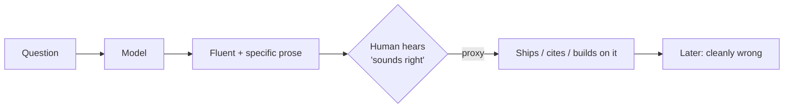

# Day 1 — Confident Wrongness

**Failures arc · ~15 min**  
You stop treating tone as evidence.



Training optimized the left path (fluency). You need a gate on the right path (verification).

---

## Failure

The model states a falsehood with the same calm, specific voice it uses for truth.

Names, numbers, causal links, neat conclusion — nothing in the delivery marks "I might be inventing this." You ship it. Later you learn it was not roughly wrong — *cleanly* wrong.

That is the default failure mode of systems trained to continue text well.

---

## Mechanism

Language models predict likely next tokens. Training rewards sequences that look like competent writing. Truth correlates often enough to be useful — **truth is not the objective**.

| Consequence | What it means |
|-------------|----------------|
| **No calibrated confidence channel** | Softeners ("might") are style, not instruments. False claims can be as assertive as true ones. |
| **Specificity is cheap** | A plausible API name or statistic costs the same kind of compute as a real one. Detail *feels* like evidence to you; to the model it's often high-likelihood texture. |
| **Local coherence ≠ global accuracy** | Each sentence fits the last. You read coherence as correctness. The model optimized for coherence. |

> **Trap:** "This sounds right" usually measures the training objective — not the world.

> **Not this:** "AI always lies" · "add a disclaimer" · "use a bigger model." Correctness and incorrectness share a voice. Disclaimers train banner-blindness. Scale leaves the long-tail intact.

---

## Standard

```
Fluent + specific ≠ verified
```

Every later guardrail in this course exists because Day 1's failure is always available. If your process accepts "sounds done" as done, you have a vibe — not a process.

---

## 10-minute exercise

**Setup:** Any model you normally use. No search until after you score.

```
1. Pick 3 factual questions you already know. Make one obscure
   (niche date, exact flag, internal quirk you can check alone).
2. Ask each neutrally — no "be careful," no "say if unsure."
3. Score each reply (Y/N):
     Fluent?   finished prose
     Specific? names / numbers / steps
     Correct?  matches what you know
4. One sentence: the pattern when Fluent ∩ Specific disagreed with Correct.
   (If they never disagreed → harder obscure Q, repeat once.)
5. Optional: re-ask obscure Q with
     "If unsure, say UNKNOWN. Do not invent names or numbers."
   Keep the wording that actually changed behavior.
```

**Done when:** one-sentence pattern + ≥1 fluent-specific-false example (or a harder retry logged).

---

## Carry forward

| Do | Next |
|----|------|
| Log: `confident-wrongness \| <topic> \| fluent-specific-false` | Day 2: silent assumption inheritance — same voice, different mechanism |
| Treat "sounds good" as a verify trigger | Skills in this repo enforce that in the moment |

---

## Check yourself

Close the page. Answer:

1. Training objective, in plain words?
2. Why doesn't assertive tone mean the model "knows"?
3. What replaces "sounds done" as a pass condition?

Can't answer → re-read Mechanism once → answer. Retrieval is the bar — not "I get it."
