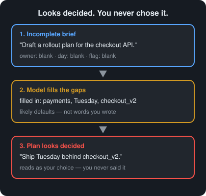
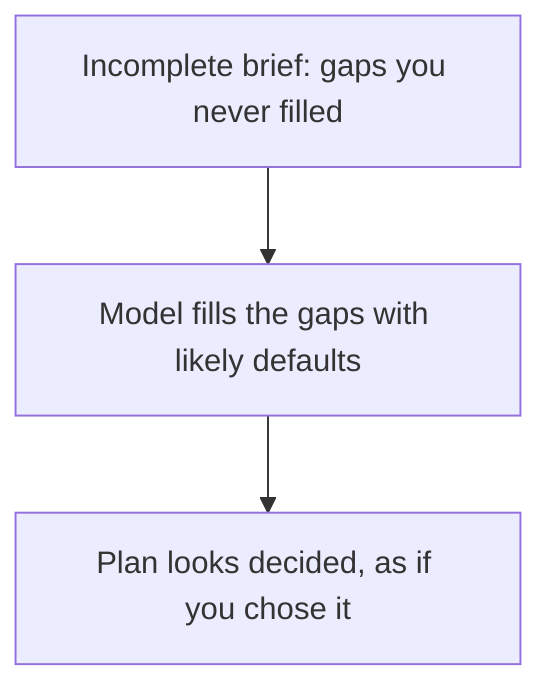

# Day 2 — Silent Assumption Inheritance

**Time:** ~15 min

## What you'll learn

When a brief is incomplete, AI often fills the gaps with *likely* defaults — then builds on those defaults as if you stated them. After today you will spot **inherited assumptions** before you treat the plan as yours, and you'll have two moves that catch them: **ask so missing premises show up as UNKNOWN**, then **check each filled-in premise against what you actually decided**.

## See it

An incomplete brief leaves blanks. The model fills them. The plan then looks like you already decided.





```text
Incomplete brief  ->  model fills the gaps  ->  plan looks decided
"roll out the API"    Tuesday, flag name        as if you chose them
```

## Story

You ask: "Draft a rollout plan for the new checkout API."

The reply arrives finished: canary at 5%, feature flag named `checkout_v2`, two-week bake, rollback by flipping the flag, Slack `#payments-oncall` for the page, deploy on Tuesday after the 10am freeze window.

None of that was in your message. You never named a flag, a channel, a day, or a canary size. The model *completed* a normal-looking rollout story from patterns it has seen before.

You paste the plan into a ticket. A teammate asks: "Who approved Tuesday? We don't have a freeze window." The flag name doesn't exist. On-call is in a different channel. The plan was coherent — and half of it was inherited, not decided.

That is **silent assumption inheritance**: unstated premises treated as facts and built on. The answer does not say "I'm assuming…". It just continues as if the gaps were filled.

## Why it happens

Models are trained to **follow instructions and continue text that looks complete**. An incomplete brief is a prompt with holes. Instruction-following does not stop at the edge of what you wrote — it **fills those holes with the most likely continuation**.

1. **Missing constraints get completed, not flagged.** If you omit environment, audience, deadline, ownership, or "must not," the model still has to produce a next token. Likely defaults (common flag names, common canary percent, common team rituals) come more easily than writing "you didn't say." So gaps become invented specifics unless you force UNKNOWN.

2. **Inherited premises look like your decisions.** Once the model inserts "feature flag `checkout_v2`," later sentences treat that name as given. Your brain reads one smooth plan. You do not see a list of "things I never said." The inheritance is silent because it is woven into the prose, not labeled as an assumption.

3. **Helpfulness rewards finishing the story.** A reply that stops and asks clarifying questions can feel less "done" than a full plan. Training and product design push toward a complete-looking artifact. A finished-looking plan is not the same as a plan that matches what you meant.

**Trap in one line:** When you think "this plan matches how we usually do it," you may be measuring how well the answer matches common patterns — not how well it matches what you actually specified.

**Not useful fixes:** "Be more careful in the prompt" (care alone is not a check). "Always ask clarifying questions" as vague advice (without a required UNKNOWN list, the model still fills). "Use a bigger model" (stronger models are often *better* at plausible fill-ins).

## Rule

**What the model filled in is not what you decided — until you mark it.**

Day 1 taught: finished-sounding is not verified. Day 2 adds: **complete-looking is not fully specified by you.** A plan can pass the "sounds done" test while resting on premises you never chose.

## Ask first

Do this first, every time the brief might be incomplete. These prompt moves do not make the model psychic. They raise the odds you get a visible assumption list — or an honest UNKNOWN — instead of a polished plan that smuggles defaults.

Leaving every gap for a later "common sense" pass is hard. Better asks put the gaps on the page. Verification is still required — it is cheaper when assumptions are listed instead of buried.

**Practice workout:** [assumption-register](./practice/day-02-assumption-register/SKILL.md) — the same template plus the check steps. Customize it; it is a workout prompt, not a main repo skill.

1. **Require an assumption list before the plan.** Tell the model: *Before any recommendations, list every premise you are using that I did not state. Label each ASSUMED or UNKNOWN. Do not treat ASSUMED items as decided.*
   **Why this helps:** Without that rule, premises hide inside the plan. With it, fill-ins must appear as a separate list you can reject.

2. **Ban silent defaults for named classes of detail.** Add wording like: *Do not invent: flag names, channel names, owners, dates, percentages, environments, or "how we usually do it" rituals. If I did not specify them, write UNKNOWN.*
   **Why this helps:** Those classes are where inheritance is most expensive. Naming them makes the ban concrete. UNKNOWN is useful: you know what still needs a human decision.

3. **Ask for a split: given versus filled-in.** Tell it to label each concrete detail: GIVEN (from my words) or FILLED-IN (not in my words).
   **Why this helps:** Smooth prose mixes your constraints and its defaults. Labels force a split you can scan in seconds.

4. **Prefer an assumption-first ask over "write a full plan."** Ask: *"Here is an incomplete brief. List inherited assumptions first; then a plan that only uses GIVEN items plus items I explicitly accept."*
   **Why this helps:** Open "draft a plan" invites completion. Assumption-first asks demand a gate before building.

**Copy-paste template** (reuse it; swap in your brief):

```text
Task: [YOUR INCOMPLETE BRIEF]

Rules:
1. First, list every premise you need that I did not state. Label each ASSUMED or UNKNOWN.
2. Label every concrete detail in your answer GIVEN (from my words) or FILLED-IN (not from my words).
3. Do not invent flag names, channel names, owners, dates, percentages, environments, or team rituals. If missing, write UNKNOWN.
4. Do not treat ASSUMED or FILLED-IN items as decided. Build the plan only on GIVEN items plus UNKNOWN placeholders I must fill.
5. If you cannot proceed without a missing constraint, stop and list the UNKNOWNs — do not quietly pick a default.
```

**Limit:** Better asking surfaces inheritance. It does **not** guarantee the list is complete. That is why you still check.

## Then check

You asked for assumptions and UNKNOWN. Now you use them. Keep this short and mechanical:

1. **Highlight every FILLED-IN or ASSUMED line.** If the model skipped the list and jumped to a finished plan, fail the draft — re-run the ask. No list means you cannot verify inheritance.

2. **Match each filled-in premise to a real decision.** For each ASSUMED or FILLED-IN item: accept (write it into your brief), replace (your real value), or reject (leave UNKNOWN and block). Do not mentally accept a default because it sounds normal.

3. **Draft versus decided (two buckets).** Keep the model's plan as a **draft**. Promote a line to **decided** only after you confirm it was GIVEN or you explicitly accepted a fill-in. Same chat window is fine; two mental buckets are not optional.

4. **One blocking question for plans that matter.** Before you ship the plan: *"Which steps fail if an UNKNOWN stays unknown?"* If the answer is "none," the UNKNOWNs were decoration — tighten the ask until unknowns actually gate progress.

You are not reverse-engineering a smooth essay from scratch. You verify the assumption list the model was asked to supply. Asking well makes catching inheritance cheaper.

**The rule, made operational:** complete-looking is not fully specified by you. Asking first raises the odds of a visible list. Checking is how you refuse to inherit defaults by tone alone.

## 10-minute exercise

**Setup:** Use any model you normally use.

1. Write **one incomplete brief** (2–4 sentences) for something real at work — a rollout, a design doc outline, a migration note, or a support reply. Deliberately omit at least three of: owner, environment, deadline, success metric, must-not, channel or tool names.
2. Ask **neutrally first** — no assumption rules. Score the reply:
   - **Finished?** Does it read like a complete plan?
   - **Specific?** Does it include names, percentages, dates, or channels you never wrote?
   - **Inherited?** Write down every concrete detail that was **not** in your brief.
3. Write **one sentence** about the pattern when the reply was finished *and* specific because of inheritance.
   If nothing was inherited: shorten the brief further and repeat steps 2–3 once.
4. **Practice Ask first:** re-ask using the **copy-paste template** above (swap in your brief). Note what changed — an assumption list appeared, UNKNOWNs appeared, invented names shrank, or nothing changed.
5. **Practice one Then check step** on whatever the re-ask returned:
   - Mark each ASSUMED or FILLED-IN item: accept / replace / reject.
   - Write one line: which UNKNOWN you would block on before shipping.
6. **Optional stretch:** Re-run with your accepted values pasted as GIVEN; confirm the FILLED-IN count drops and the plan still makes sense.

**Done when:** You have the inherited-detail list from the neutral ask, a written result from the re-ask, **and** a written accept / replace / reject pass with at least one blocking UNKNOWN.

## Carry to next day

| Keep this | Day 3 builds on it |
|-----------|-------------------|
| Log one line: `assumption-inheritance \| <topic> \| <N> filled-ins caught` | Same fill-in pressure, different failure: earlier constraints vanish mid-thread |
| Log one ask line: `ask \| assumption-register template \| <better / same / worse>` | Later lessons stack more checks on "complete-looking is not decided" |
| Log one verify line: `verify \| accept-replace-reject \| <pass/fail>` | Day 3 turns attention to what disappears when the thread gets long |
| Treat a finished plan with no assumption list as **incomplete** — not done | |

## Check yourself

Close the page. Answer without looking:

1. In plain words, what does the model do when your brief has holes?
2. Why can a plan sound "like how we usually work" and still be wrong for *your* case?
3. What should replace "looks complete" as your pass condition for a plan?
4. Name **one Ask first tip** and **one Then check tip** you could use on a work brief today.

Stuck on any → re-read **Why it happens**, **Ask first**, and **Then check** once → answer again. Being able to say it back is the bar — not "I get it."
