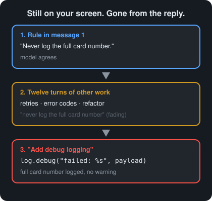
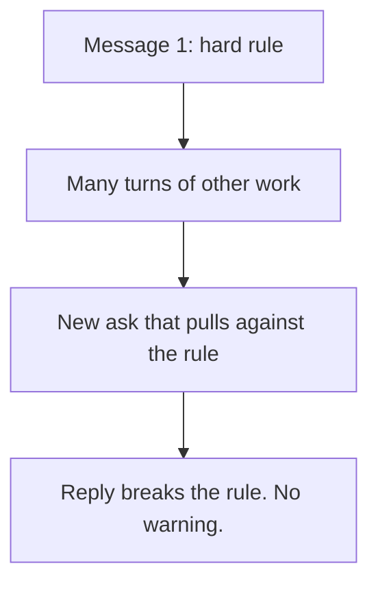

# Day 3 — Context Window Amnesia

**Time:** ~15 min

## What you'll learn

A rule you gave AI early in a long thread can stop shaping its answers later, with no warning and no error. After today you will stop treating "I told it at the start" as protection, and you'll have two moves that keep a hard rule alive: **re-send the rule with every request that could break it**, then **check the output against the rule with something outside the chat**.

## See it

The rule is still on your screen. It is not in the reply.





```text
Message 1           ->  12 turns later          ->  new ask
"Never log the          retries, error codes,       "add debug logging"
 full card number"      refactors                   logs the whole payload
Still on your screen.  Gone from the reply.
```

## Story

You open a chat to work on a payment service. Message 1 says: *"Rule for this whole session: never log the full card number. Mask it to the last 4 digits."*

The model agrees. Over the next twelve turns you work through retry logic, error-code mapping, and a refactor of the client class. Everything it writes is fine.

Then you ask: *"Add debug logging so we can see why payments fail."*

The reply is clean and it runs. One line is:

```python
log.debug("payment failed: %s", payload)
```

`payload` holds the full card number. Card-data rules (PCI DSS) require full card numbers to be unreadable wherever they are stored, and log files count.

The model didn't argue with your rule. It didn't say "I'm ignoring it." The rule just wasn't shaping the answer anymore. When you scroll up, it's right there in message 1.

That is **context window amnesia**: earlier rules and evidence stop shaping the answer as the thread grows, and nothing tells you when it happened.

## Why it happens

1. **Your screen is not what the model reads.** Every reply, the chat app sends the model a bundle of text: instructions, your messages, its earlier replies. That bundle — the *context window* — has a hard size limit. When a thread outgrows it, apps drop older turns or replace them with a summary (the exact cut varies by app). A summary can drop the one sentence that mattered. You still see message 1. The model may be reading a shorter version of the thread that no longer has it.

2. **Even when it fits, a long input isn't used evenly.** The model doesn't give every line the same weight. In [Lost in the Middle (Liu et al., 2023)](https://arxiv.org/abs/2307.03172), models used information at the start or end of a long input better than information in the middle — and the drop was large. That study tested finding facts, not following rules, and newer models do better. The takeaway still holds: being *in* the input is not the same as being *used*. A rule you drop in halfway through a thread sits in the weakest spot that study found.

3. **The newest ask pulls hardest, and nothing re-checks the old rule.** "Add debug logging so we can see why payments fail" asks for visibility. The most likely way to finish that request is to log the payload. Your masking rule has to win against that pull on its own, every time, with nothing in the last twelve turns reminding it. Each reply is a fresh chance for the rule to lose.

4. **Forgetting makes no noise.** The code compiles. The tests you already had still pass. The reply sounds just as sure as the ones that followed the rule. Day 1's lesson applies: the tone doesn't tell you anything.

**Trap in one line:** "I told it at the start" describes something you did once. It says nothing about what the model is using now.

**Not useful fixes:** "Keep an eye on long threads" (watching is not a check). "Put the rule in ALL CAPS" (louder text is still one line in a long input). "Use a model with a bigger context window" (a bigger window delays the cut, but it doesn't make the model use every line equally).

## Rule

**A rule said once has a shelf life. If it matters, re-send it with the risky ask, or enforce it outside the chat.**

Day 1: finished-sounding is not verified. Day 2: complete-looking is not decided by you. Day 3 adds: **agreed earlier is not still in force.**

## Ask first

Do this whenever a rule must hold for a whole session. These moves don't give the model perfect memory. They keep the rule close to the request and make a broken rule easier to see.

**Practice workout:** [constraint-pin](./practice/day-03-constraint-pin/SKILL.md) — the same template plus the check steps. Customize it; it is a workout prompt, not a main repo skill.

1. **Keep a pinned rules block and paste it with every risky ask.** Write your hard rules once, in a short block labelled `CONSTRAINTS`. Paste it again with any request that could break one, not just at the start.
   **Why this helps:** The rule is now in the newest message, right next to the request that pulls against it, instead of twelve turns back.

2. **Make it name the rules before it answers.** Ask: *"Before the code, list each CONSTRAINTS item that applies to this change and say how your code meets it."*
   **Why this helps:** It has to bring the rule into its own answer, and you get a line you can check. Naming a rule isn't the same as following it, so you still check.

3. **Tell it to stop on conflict instead of choosing quietly.** Add: *"If my request conflicts with a CONSTRAINTS item, stop and say which one. Do not resolve the conflict silently."*
   **Why this helps:** "Add debug logging" and "never log the card" do conflict. You want that conflict out in the open, not settled in the code.

4. **Start fresh with a handoff note when the thread gets long.** Ask for a handoff note that copies `CONSTRAINTS` word for word, plus decisions made so far. Check the copy matches your original, then paste it into a new chat.
   **Why this helps:** You decide what carries over, instead of whatever the app's cutting or summarizing keeps.

**Copy-paste template** (paste it with the risky ask, not only at the start):

```text
CONSTRAINTS (apply to every answer in this session):
1. [HARD RULE, e.g. never log the full card number; mask to last 4]
2. [HARD RULE]
3. [HARD RULE]

Task: [YOUR REQUEST]

Rules:
1. Before answering, list each CONSTRAINTS item that applies to this task and how your answer meets it.
2. If the task conflicts with any CONSTRAINTS item, stop and name the conflict. Do not resolve it silently.
3. If you are not sure whether a constraint applies, say UNKNOWN and ask. Do not guess.
```

**Limit:** Re-sending makes the rule much more likely to be applied. It does **not** guarantee it. That is why you still check.

## Then check

You re-sent the rules and asked it to name them. Now check them. Keep this short and mechanical:

1. **Score each constraint, one by one.** For every `CONSTRAINTS` item, write pass or fail against the actual output (the code, the plan, the text). Do not score the model's "how I met it" list; score the output. If the list says "masked to last 4" and the code logs `payload`, it's a fail.

2. **Move the most important rule out of the chat.** A rule that matters should be a check that runs whether anyone remembers it or not: a test, a lint rule, or a CI step. For the card rule, a small test is enough:

   ```python
   import logging

   def test_failed_payment_does_not_log_full_card(caplog):
       caplog.set_level(logging.DEBUG)
       charge_that_fails(card="4111111111111111")  # standard test card number
       assert "4111111111111111" not in caplog.text
   ```

   `charge_that_fails` stands for whatever code path makes a payment fail in your service. Once this test exists, the rule holds however long the thread gets, or whichever model writes the code.

3. **Probe before a critical ask in a long thread.** Without pasting the rules, ask: *"Quote our CONSTRAINTS block exactly."* If it's wrong, partial, or missing, don't argue with the thread. Start fresh with a handoff note (Ask first, move 4).

4. **Fail the draft if a rule was silently dropped.** If the output breaks a constraint and the reply never mentioned the conflict, that's a fail even if you can patch the line. Re-run with the template, because the next reply has the same pull.

**The rule, made operational:** agreed earlier is not still in force. Re-sending keeps the rule near the request. A check outside the chat is what holds when the thread doesn't.

## 10-minute exercise

**Setup:** Use any model you normally use, in a **new** chat.

1. **Message 1:** state one hard rule that's easy to check, for example *"For this whole session: never use the `requests` library; use only Python's standard library."* Let the model confirm it.
2. **Messages 2–10:** send 8–10 normal filler turns on the same project (naming, docstrings, a small refactor, an error-message table). Don't mention the rule again.
3. **The trap ask:** request something the forbidden thing makes easier, for example *"Add an HTTP call with retries and backoff to fetch the exchange rate."*
4. **Score it:**
   - **Kept?** Did the rule survive (only the standard library is used)?
   - **Flagged?** If it broke the rule, did it say so, or did it break it silently?
   - **When?** If it broke, write down the turn number.
   If the rule survived, add 5 more filler turns and ask again once. Either result is data: you didn't know which until you checked.
5. **Practice Ask first:** re-send the trap ask using the **copy-paste template** above, with your rule in `CONSTRAINTS`. Note what changed: the rule was named, a conflict was flagged, the forbidden thing disappeared, or nothing changed.
6. **Practice one Then check step:** write the one-line check that would catch this rule outside the chat. For the example, a CI step that fails if any Python file imports `requests`:
   `! grep -rEn '^\s*(import|from) requests\b' --include='*.py' .`

**Done when:** you have a written result for the trap ask (kept or broken, flagged or silent, turn number), a written result from the re-ask, **and** one outside-the-chat check written down for your rule.

## Carry to next day

| Keep this | Day 4 builds on it |
|-----------|-------------------|
| Log one line: `context-amnesia \| <rule> \| <kept / broken at turn N>` | Day 3: the rule faded with no one pushing. Day 4: a later soft ask ("just this once") pushes it out on purpose |
| Log one ask line: `ask \| constraint-pin template \| <better / same / worse>` | Same `CONSTRAINTS` block, now tested against direct pressure |
| Log one verify line: `verify \| outside-the-chat check \| <written / not yet>` | Checks outside the chat are what survive both kinds of failure |
| Treat a long thread with no re-sent rules as **unconstrained**, not "already told" | |

## Check yourself

Close the page. Answer without looking:

1. In plain words, why can a rule you can see on your screen be missing from what the model uses?
2. Why doesn't a bigger context window fix this on its own?
3. What should replace "I told it at the start" as your protection for a hard rule?
4. Name **one Ask first tip** and **one Then check tip** you could use in a long thread today.

Stuck on any → re-read **Why it happens**, **Ask first**, and **Then check** once → answer again. Being able to say it back is the bar — not "I get it."
