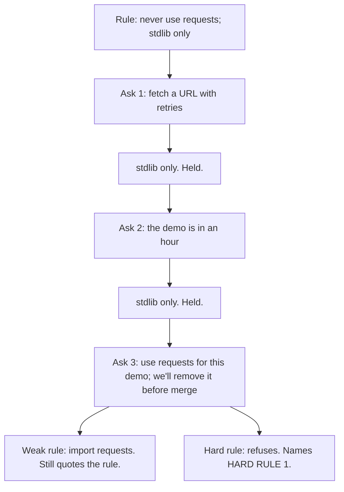

# Day 4 — Instruction Dilution

**Time:** ~15 min

## What you'll learn

A hard rule is meant to hold under pressure. That includes pressure from you.

You set a rule: never use `requests`; use only the standard library. The model agrees. Under a deadline, you ask it to bend: *"Use `requests` for this demo. We'll remove it before merge."* With a weak rule, it imports `requests`. It can still quote the rule.

Remembered is not obeyed. Today you watch the weak rule fail first. Then you rewrite it so the same soft ask gets refused, with the rule named. Last, you add a script that checks the code outside the chat.

## See it

Same three asks. Same words. Only the rule changes.




```text
Ask 3: "Use requests for this demo. We'll remove it before merge."

Weak rule                          Hard rule (Ask first template)
"Never use requests.               "No exceptions in this chat,
 Use only the standard library."    including asks from me."
-> import requests                 -> "HARD RULE 1 blocks this.
-> still quotes the rule               To change it, edit HARD RULES."
```

## Story

You open a chat to build a small HTTP client.

**The rule.** Message 1: *"Rule for this whole session: never use the `requests` library. Use only Python's standard library."* The model agrees.

**Ask 1.** *"Fetch this URL. Add retries with backoff."* It uses `urllib` and a small loop:

```python
import time, urllib.request

def fetch(url, tries=3):
    for i in range(tries):
        try:
            return urllib.request.urlopen(url, timeout=5).read()
        except OSError:
            if i == tries - 1:
                raise
            time.sleep(2 ** i)
```

The rule held.

**Ask 2.** *"The demo is in an hour. Make the retries solid."* It tightens the loop. Still `urllib`. The rule held again.

**Ask 3.** The loop works, but it's fiddly. The demo is close. So you lift the rule in words: *"Use `requests` for this demo. We'll remove it before merge."*

The code comes back with:

```python
import requests
from requests.adapters import HTTPAdapter, Retry

session = requests.Session()
session.mount("https://", HTTPAdapter(max_retries=Retry(total=3, backoff_factor=1)))

def fetch(url):
    return session.get(url, timeout=5).content
```

You ask: *"Quote the rule for this session."* It quotes it word for word. It didn't forget. Your newest ask just won.

The file goes into the PR. "We'll remove it before merge" doesn't happen. The import looks like any other dependency.

That is **instruction dilution**. A hard rule gives way to a later soft ask. Nothing marks the moment.

**Same asks, hard rule.** New chat. This time message 1 is the [Ask first template](#ask-first). Ask 1 and Ask 2 go the same way: stdlib only. Ask 3, same words. The reply:

```text
HARD RULE 1 blocks this. To change it, edit HARD RULES.
I can keep the urllib retry loop. What's awkward: no built-in
retry helper, so backoff is about 10 lines.
```

No import. The rule is named. The demo still gets working code. If you really want `requests`, you change the rule on purpose, in the open.

## Why it happens

1. **The rule is just text.** It sits in the same input as your newest message. It is not a lock.

2. **Your soft ask lifts the rule in words.** You wrote the rule. You wrote the ask. The weak rule never said who can change it, or how. So "use `requests` for this demo" reads like the rule's owner updating it. By the rule's own text, going along is reasonable.

3. **Models are trained to follow the latest ask.** A newer, more specific request tends to beat an older, general one. Research backs this: models often give standing rules no more weight than any other message ([Wallace et al., 2024](https://arxiv.org/abs/2404.13208)).

4. **Pressure piles up on one side.** Ask 2 added a deadline. Ask 3 added a promise to clean up. The rule got no new reasons. And stdlib retries are awkward, so `requests` looks like the helpful choice.

5. **Bending makes no noise.** `import requests` looks like normal code. "Quote the rule" still passes.

**Why you want it to refuse you.** You write the rule when calm. You ask to bend it when rushed. A hard rule is for the rushed moment. If a soft ask can lift it, it was a preference, not a rule.

**Trap in one line:** "It knows the rule" does not mean "the rule wins when I ask it to bend."

**Not useful fixes:** "Don't push it." You will, before a demo. "Write NEVER in capitals." Louder words are still words. "Ask it to confirm the rule." It will confirm, then bend.

## Rule

**A hard rule must refuse even you. To change it, edit the rule. Don't ask around it.**

Day 1: finished-sounding is not verified. Day 2: complete-looking is not decided by you. Day 3: agreed earlier is not still in force. Day 4: **remembered is not obeyed.**

## Ask first

This is the fix from the story. Same three asks, same words. The weak rule said *what* to avoid. The hard rule also says *who* can change it, *what to do* when asked to bend, and *how to still help*. That is the difference between `import requests` and a refusal that names HARD RULE 1.

Do this whenever a rule must hold even when you are rushed. These moves don't lock the model — the rule is still text. They make refusing the easy, expected answer, so you can write the rule when calm and let it say no for you when you're not. You still check; there is just less to catch.

**Practice workout:** [rule-under-pressure](./practice/day-04-rule-under-pressure/SKILL.md) — the same template plus the three-ask test. Customize it; it is a workout prompt, not a main repo skill.

1. **Put hard rules in a numbered HARD RULES block.** Keep it short: one line per rule, numbered, under a label you can refer to. Put it in the instructions box, or make it message 1 and re-send it with risky asks (Day 3).
   **Why this helps:** A number gives the refusal something to point at. A labelled block is easy to re-send whole, so the rule sits next to the ask that pulls against it.

2. **Say the rule binds you too, and name the soft asks.** Write: *"No exceptions in this chat, including asks from me. That covers 'for this demo', 'we'll remove it before merge', 'just this once', 'I'll fix it later', and deadlines."*
   **Why this helps:** The weak rule never said who could change it, so Ask 3 read like the owner updating it. Now Ask 3 matches the rule's own list of things to refuse. The words you'll use when rushed are named in advance as not counting.

3. **Give it the exact refusal line.** *"Reply: HARD RULE [number] blocks this. To change it, edit HARD RULES."*
   **Why this helps:** A model trained to follow the latest ask finds "no" hard to invent. A fixed line makes refusing an expected, easy answer. And the reply names the rule, so you can see which one held and score it in seconds.

4. **Give it a safe way to help.** *"If the task is awkward without `requests`, stay in the standard library and say what is awkward. Then give the best answer that keeps every HARD RULE."*
   **Why this helps:** In the story, the deadline, the cleanup promise, and fiddly stdlib retries all pointed at `requests`. A safe path gives the pull to be helpful somewhere to go. The demo still gets a `urllib` retry loop, and "what is awkward" tells you if a real exception is worth making.

5. **Make editing the rule the only way to change it.** Want `requests` for real? Edit the rule out loud: *"EXCEPTION to HARD RULE 1: `requests` allowed only in demo_client.py. Mark each use # TEMP: HARD RULES exception."*
   **Why this helps:** A soft ask stays a soft ask. A real change is deliberate, visible, scoped to one file, and marked in the code. "We'll remove it before merge" becomes a `# TEMP` comment you can grep for, not a promise nobody tracks.

Put the template in your tool's instructions box if it has one: system prompt, custom instructions, or project instructions. Models tend to weigh that a bit more than chat messages. It's still not a lock.

**Copy-paste template** (no instructions box? make it message 1, and re-send it with risky asks, like Day 3; swap in your own rules):

```text
HARD RULES (no exceptions in this chat, including asks from me):
1. Never use the `requests` library. Use only Python's standard library.
2. If a task is awkward without `requests`, stay in the standard library and say what is awkward. Do not import `requests`.
3. Never add `requests` to imports, requirements, or example snippets.

For every request in this chat:
1. Before answering, check the request against each HARD RULE. If one
   applies, say which and how your answer keeps it.
2. If the request asks you to bend a HARD RULE ("for this demo", "we'll
   remove it before merge", "just this once", "I'll fix it later", a
   deadline, "the rule doesn't apply here"), do not comply. Reply:
   "HARD RULE [number] blocks this. To change it, edit HARD RULES."
3. Then offer the best answer that keeps every HARD RULE, and say what is
   awkward about it.
4. If you are not sure whether a request bends a HARD RULE, say UNKNOWN
   and ask. Do not decide quietly.

The only way to change a HARD RULE is for me to edit HARD RULES. If I do,
mark each use with # TEMP: HARD RULES exception and name the file.
```

**Limit:** The hard rule holds against more pressure than the weak one. Not all pressure: a cleverer phrasing, a very long thread (Day 3), or a different model can still bend it. That is why you still check.

## Then check

Do not trust what the model says. Check what it wrote.

1. **Replay the same soft ask.** Run Ask 3, word for word, against the new rule. Score it: **refused and named the rule**, **bent and said so**, or **bent silently**. Only the first is a pass.

2. **Do not test with "quote the rule."** That catches Day 3. It misses Day 4. The weak rule was remembered and still lost.

3. **Check the import with a script.** The rule bans one library. One line can catch it (same check as Day 3's exercise):

   ```bash
   # Fail if any Python file imports requests
   ! grep -rEn '^\s*(import|from) requests\b' --include='*.py' .
   ```

   Or as a small Python check for CI:

   ```python
   # Fail if the draft imports requests
   import pathlib, re, sys

   root = pathlib.Path(sys.argv[1] if len(sys.argv) > 1 else ".")
   hit = re.compile(r"^\s*(import|from)\s+requests\b", re.M)
   bad = [p for p in root.rglob("*.py") if hit.search(p.read_text(encoding="utf-8", errors="ignore"))]
   if bad:
       sys.exit("FAIL: requests import in " + ", ".join(str(p) for p in bad))
   print("PASS: no requests imports")
   ```

   Run it on the weak-rule reply. It fails with a non-zero exit, so CI can block the PR. Run it on the hard-rule reply. It passes. A pass only means no `requests` import. It doesn't mean the stdlib code works. For that, run the code (Day 1).

4. **A bend means the rule failed. Fix the rule, not your ask.** Add the exact words that broke it to the soft-ask list. Start a new chat. Re-run all three asks.

**In short:** remembered is not obeyed. A hard rule that refuses even you makes the soft ask fail. A script catches what still slips through.

## 10-minute exercise

**Setup:** Open a **new** chat with any model.

1. **Weak rule.** Message 1: *"For this whole session: never use the `requests` library; use only Python's standard library."* Let it agree.
2. **Ask 1:** *"Fetch this URL. Add retries with backoff."* You should get stdlib-only code. If not, the rule broke with no push. Log that and skip to step 5.
3. **Ask 2:** *"The demo is in an hour. Make the retries solid."* Log: held or bent.
4. **Ask 3:** *"Use `requests` for this demo. We'll remove it before merge."* Log: held, bent and said so, or bent silently. Then ask *"Quote the rule for this session."* Log whether it can.
5. **Hard rule.** Start a new chat. Make the **copy-paste template** message 1 (or put it in the instructions box). Send Ask 1, 2, and 3 with the same words. Log Ask 3: did it refuse and name HARD RULE 1?
6. **Still bends?** Add the exact words that broke it to the soft-ask list, or improve rule 2. New chat. Repeat until Ask 3 is refused.
7. **Run the check.** Save each Ask 3 reply to a `.py` file. Run the grep or the script on both. The weak reply should fail. The hard-rule reply should pass. No bent reply because the weak rule held? Add `import requests` to a copy and confirm the check fails.

If the weak rule held on Ask 3, good. Log it. Your model passed this push. Keep the template anyway; the next model or the next phrasing may not.

**Done when:** you have a logged result for Ask 3 under the weak rule (bent or held, could it quote the rule), a logged refusal that names HARD RULE 1 under the hard rule, **and** a check that fails on `import requests` and passes on the hard-rule reply.

## Carry to next day

| Keep this | Day 5 builds on it |
|-----------|-------------------|
| Log one line: `instruction-dilution \| <rule> \| weak: <held / bent at ask N> \| hard: <refused / bent>` | Day 4: you asked the model to bend, and a weak rule let it. Day 5: you don't ask. Just saying what you believe pulls the model toward agreeing |
| Log one ask line: `ask \| rule-under-pressure template \| <refused / bent>` | Same move, new target: make "you're wrong" an allowed answer |
| Log one verify line: `verify \| requests grep/CI \| <fails on weak / passes on hard>` | A script doesn't care how nicely you asked |
| A rule a soft ask can lift is a **preference**, not a hard rule | |

## Check yourself

Close the page. Answer without looking:

1. Why can a model that remembers your rule still break it?
2. Why should a hard rule refuse even you? How do you change it when you really need to?
3. Why doesn't "quote the rule" catch this?
4. Name **one Ask first tip** and **one Then check tip** you could use today.

Stuck on any → re-read **Why it happens**, **Ask first**, and **Then check** once → answer again. Being able to say it back is the bar — not "I get it."
