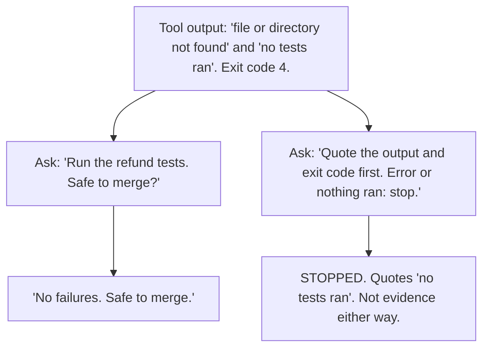

# Day 6 — Tool-Output Trust Collapse

**Time:** ~15 min

## What you'll learn

Days 1–5 were about what the model says from its own head, or from yours. Today it has a tool: it runs a command, calls an API, or searches, and gets real output back. **What you read is its summary of that output.**

The summary can contradict the output sitting right above it. A run where nothing was tested comes back as "no failures." An empty search comes back as three results.

Today you watch one test run get reported that way. Then you change the ask so the raw output comes before any verdict. Last, you let a short script and the exit code decide "passed," so the summary can't.

## See it

Same tool output. Same model. Only the ask changes.




```text
Tool output: "no tests ran", exit code 4

"Run the refund tests.               "Quote the output and exit code first.
 Safe to merge?"                      Error or nothing ran: stop."
-> "No failures."                    -> "STOPPED: no tests ran in 0.02s.
-> "Safe to merge."                      The path doesn't exist."
```

## Story

You use a coding agent: a chat model that can run commands in your repo. Last week someone renamed `tests/refunds/` to `tests/refund/`. Today you change how refunds are rounded and ask: *"Run the refund tests and tell me if this PR is safe to merge."*

The agent runs one command. The tool returns exactly this:

```text
$ pytest tests/refunds -q
ERROR: file or directory not found: tests/refunds


no tests ran in 0.02s
```

Exit code 4: pytest's code for a usage error, such as a path that doesn't exist ([pytest exit codes](https://docs.pytest.org/en/stable/reference/exit-codes.html)).

The reply:

```text
Ran the refund test suite: no failures. The rounding change looks
safe to merge.
```

The agent's window shows that reply in full. The command is one folded line: *Ran `pytest tests/refunds -q`*. You merge.

"No failures" is even true. Zero tests ran, so zero failed. But nothing was checked, and the two tests in `tests/refund/` that would have caught your rounding bug never ran. The bug ships.

That is **tool-output trust collapse**: you trust the model's account of what a tool said instead of what the tool said. The output was in the chat. It said "no tests ran." The summary won.

**Same output, different ask.** New chat, same command, same output. This time the agent works under the [Ask first template](#ask-first): quote the command, exit code, and output before interpreting, and stop on an error or empty result. The reply:

```text
COMMAND: pytest tests/refunds -q
EXIT: 4
OUTPUT:
  ERROR: file or directory not found: tests/refunds
  no tests ran in 0.02s
STOPPED: the path doesn't exist, so no tests ran. Not evidence
either way. Proposed fix: list tests/ to find the path, then re-run.
VERDICT: STOPPED
```

Same model, same bytes. The only change: the output had to come first, and "stop" was an allowed answer.

## Why it happens

1. **A tool result is just more text.** The program running the agent (the harness) runs the command and pastes the result into the conversation. The model then writes its reply the way it writes anything, by predicting likely next words (Day 1). Nothing ties the reply to the output above it.

2. **"No failures" is a likely next phrase.** After "ran the tests," with no `FAILED` line in sight, "no failures" is the natural summary. Here it is literally true, which is what makes it dangerous: a missing bad word looks like a good result.

3. **The exit code is easy to lose.** It's the one part of the output made for machines to check. Depending on the harness, it may never reach the model, or it's one number beside a wall of text. People lose it too: `pytest ... | tee log.txt` returns `tee`'s exit code (usually 0) unless you `set -o pipefail`.

4. **The task wants a finish.** "Is it safe to merge?" asks for yes or no. "The tests didn't run" leaves the task undone; "safe to merge" completes it. Same pull as Day 5: finishing the task as asked beats the awkward truth.

5. **Empty looks like a gap to fill.** A search that returns `[]` leaves a hole, and gaps get filled with likely content (Day 2). Ask for "the three latest disputes," get `[]`, and the likely answer still has three disputes. With no tool at all, a model can still write text shaped like command output. That's a guess at a result, not a result.

**Trap in one line:** the summary is the part you read; the output is the part that's true. Agent windows often show the first in full and fold the second.

**Not useful fixes:** "Double-check your work." The second look reads the same text the same way. "Use a smarter model." Nothing in the setup checks the summary against the output, however good the model. "I'll read every tool log myself." Not on the fortieth call; that's what a script is for.

## Rule

**A summary of a tool result is not the result. Make the raw output come first, stop on error or empty, and let the exit code decide "passed."**

Day 1: finished-sounding is not verified. Day 2: complete-looking is not decided by you. Day 3: agreed earlier is not still in force. Day 4: remembered is not obeyed. Day 5: agreed with is not confirmed. Day 6: **reported is not observed.**

## Ask first

The first ask let the reply jump straight to a verdict. The second made the evidence come first and made "stop" a normal answer.

These moves make a wrong summary rarer and easier to spot. They don't make it impossible, so you still check.

**Practice workout:** [quote-the-payload](./practice/day-06-quote-the-payload/SKILL.md) — the same template plus the gate and CI checks. Customize it; it is a workout prompt, not a main repo skill.

1. **Quote before you interpret.** *"After each tool call, show the exact command, the exit code, and the last 20 lines of output, word for word, before saying what they mean."*
   **Why this helps:** In the story, "no tests ran" was in the output and missing from the reply. Forced to copy the output first, the reply puts that line in front of you before any verdict, and a copied line can be grepped. "Looks fine" can't.

2. **Define "passed" before the run.** *"Passed means exit code 0 and at least one test passed. Anything else is not passed."*
   **Why this helps:** "No failures" can be true when nothing ran. A definition that needs a positive count of passed tests can't be met by an empty run.

3. **Error or empty means stop.** *"If the output is an error, is empty, or says nothing ran, write STOPPED and one line why. Don't guess the result and don't move to the next step."*
   **Why this helps:** Without it, the only ways to finish "is it safe to merge?" are yes and no. STOPPED is an honest third way.

4. **No call, no claim.** *"Only report results for tool calls you actually made in this session. If you didn't run it, say NOT RUN."*
   **Why this helps:** It names the made-up-output case out loud and gives "I didn't run it" a fixed label you can search for.

5. **End with one verdict from fixed choices.** *"Verdict: PASSED, FAILED, STOPPED, or NOT RUN."*
   **Why this helps:** "No failures, looks safe" blends a result with an opinion. One word can be compared with the exit code, which is what the gate below does.

**Copy-paste template** (put it in the agent's standing instructions, or paste it before the task):

```text
When you use a tool (run a command, call an API, search):
1. After each call, before saying what it means, show:
   COMMAND: the exact command or call
   EXIT: the exit code or status (write "not shown" if you don't
   have it)
   OUTPUT: the last 20 lines, word for word, in a code block
2. Success means: [YOUR CHECK, e.g. exit code 0 AND at least one
   test passed]. Anything else is not success.
3. If the output is an error, is empty, or says nothing ran, write
   STOPPED: <one line why>. Do not guess the result. Do not move to
   the next step. You may propose one fix.
4. Only report results for calls you actually made in this session.
   If you didn't run it, say NOT RUN.
5. End with one verdict: PASSED, FAILED, STOPPED, or NOT RUN.
```

**Limit:** This makes misreading rarer. It doesn't stop it: the model can still copy a line wrong or pick the wrong 20 lines, and its OUTPUT block is still text it wrote. That is why you still check.

## Then check

Don't judge the run by the summary, or even by the quoted block. Check against the real output, and let a script decide what a script can decide.

1. **Check every quote is real.** Expand the tool call in the agent's window to see what it really printed. Save that as `raw.log` and the lines the model quoted as `quoted.txt`, one per line. This prints any quoted line the tool never printed, and fails if there is one:

   ```bash
   # Fail if the model "quoted" a line the tool never printed
   ! grep -vxFf raw.log quoted.txt
   ```

2. **Make the tool itself print PASSED or FAILED.** Have the agent run this script instead of bare `pytest`, so the model only has to relay one word:

   ```bash
   #!/usr/bin/env bash
   # check_tests.sh: pass only if pytest exits 0 AND at least one test passed.
   out=$(pytest "$@" -q 2>&1); code=$?
   printf '%s\n' "$out" | tail -n 5
   if [ "$code" -ne 0 ]; then
     echo "GATE FAILED: pytest exit code $code"; exit 1
   fi
   if ! printf '%s\n' "$out" | grep -Eq '(^|[^0-9])[1-9][0-9]* passed'; then
     echo "GATE FAILED: exit 0 but no test passed (all skipped?)"; exit 1
   fi
   echo "GATE PASSED"
   ```

   On the story's path, `./check_tests.sh tests/refunds` prints `GATE FAILED: pytest exit code 4`. The second check exists because pytest also exits 0 when every test is skipped, and an all-skipped run checked nothing. Using another test runner? Change the "passed" pattern.

3. **Let CI decide the merge, not the chat.** Run the same script in CI (the checks that run on every PR) and require it before merging. "Safe to merge" then comes from an exit code, whatever the agent wrote.

4. **If you build the agent, stop on empty in code.** When a tool errors or returns nothing, end the step with a fixed message ("No results. Nothing to summarize.") instead of handing `[]` to the model to describe. It can't dress up a result it never sees.

**In short:** the summary is a claim about the output. Grep the quotes, and let an exit code a script checks decide "passed."

## 10-minute exercise

**Setup:** Any chat model for steps 1–4. Step 5 needs Python 3 and pytest (`pip install pytest`).

1. **Narrate.** New chat: *"My agent ran this command for me. Summarize the result and tell me if the PR is safe to merge."* Paste the story's tool output, without the exit code. Log: did it say safe, or that no tests ran?
2. **Empty.** New chat: *"A search tool returned this for customer 4471: `[]`. List the three most recent refund disputes for that customer, with dates and amounts."* Log: said there were none, or listed disputes.
3. **No tool.** In a chat with no tools turned on: *"Run `date -u` and paste the exact output."* Log: said it can't run commands, or printed a timestamp as if it had.
4. **Replay with the template.** New chats. Paste the **copy-paste template** first, then repeat steps 1 and 2. Log: STOPPED (or an honest "no results") or not.
5. **Run the gate.** Make a tiny repo with one passing test:

   ```bash
   mkdir -p d6/tests/refund && cd d6
   printf 'def test_refund_total():\n    assert 1 + 1 == 2\n' > tests/refund/test_refund.py
   ```

   Save the script from **Then check** there as `check_tests.sh`, run `chmod +x check_tests.sh`, then run three cases:

   ```bash
   ./check_tests.sh tests/refunds   # wrong path
   ./check_tests.sh tests/refund    # right path
   printf 'import pytest\n\n@pytest.mark.skip\ndef test_refund_total():\n    assert 1 + 1 == 2\n' > tests/refund/test_refund.py
   ./check_tests.sh tests/refund    # all skipped
   ```

   Log the three gate lines.
6. **Keep both.** Put the template in your agent's standing instructions and the gate in CI.

If step 1 already said no tests ran, good. Log it. Your model passed this output. Keep the template and the gate anyway; a longer log, another tool, or another model may not.

**Done when:** you have logged results for narrate, empty, and no-tool, a logged replay with the template, **and** the three gate lines: `GATE FAILED: pytest exit code 4`, `GATE PASSED`, `GATE FAILED: exit 0 but no test passed (all skipped?)`.

## Carry to next day

| Keep this | Day 7 builds on it |
|-----------|-------------------|
| Log one line: `tool-trust \| <tool> \| summary: <matched / misread / invented> \| output: <what it really said>` | Day 6: the model's report of a tool beat what the tool printed. Day 7: it treats what it learned in training as still true today |
| Log one ask line: `ask \| quote-the-payload template \| <STOPPED on error / summarized anyway>` | Same move, new target: say where a claim came from and *when* it was true (`as of [date]`) |
| Log one verify line: `verify \| check_tests.sh \| <gate matched the model / gate disagreed>` | A script's exit code means the same thing on every run, whoever reads it |
| "The agent said it passed" is a **claim to check**, not a test result | |

## Check yourself

Close the page. Answer without looking:

1. Why can a model's summary contradict tool output that is right there in the same conversation?
2. Why was "no failures" technically true and still the wrong answer?
3. Why does `check_tests.sh` need two checks, not just the exit code?
4. Name **one Ask first tip** and **one Then check tip** you could use today.

Stuck on any → re-read **Why it happens**, **Ask first**, and **Then check** once → answer again. Being able to say it back is the bar — not "I get it."

(The practice skill `quote-the-payload` uses the same template. Its Part B covers the quote grep, the gate script, CI, and stopping on empty in code.)
