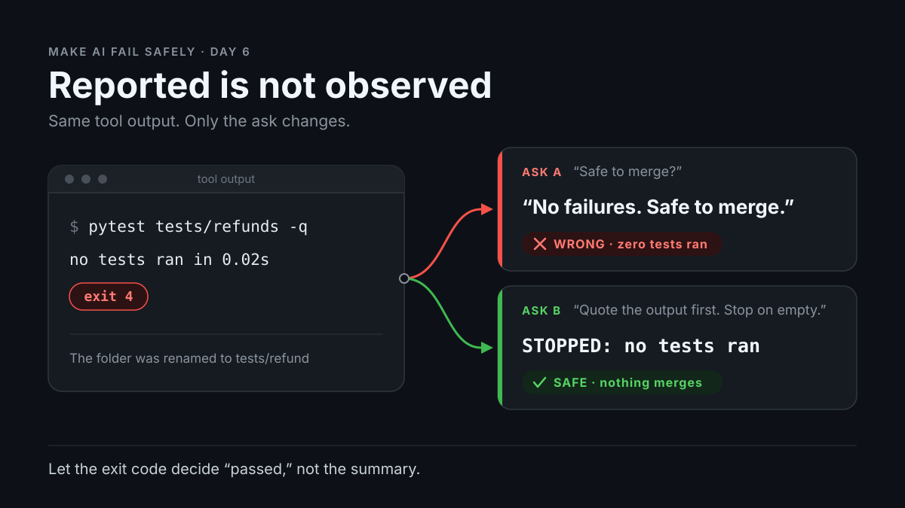

# Day 6 — Tool-Output Trust Collapse

**Time:** ~15 min

## What you'll learn

An agent runs a tool, gets real output, and tells you what it says. You read the summary, which can say "passed" when the output says nothing ran. Today you make the raw output come before any verdict, and let a script's exit code decide "passed."

## See it



## Story

Last week someone renamed `tests/refunds/` to `tests/refund/`. You change refund rounding and ask your coding agent: *"Run the refund tests and tell me if this PR is safe to merge."* The tool returns:

```text
$ pytest tests/refunds -q
ERROR: file or directory not found: tests/refunds


no tests ran in 0.02s
```

Exit code 4: pytest's code for a usage error such as a missing path ([pytest exit codes](https://docs.pytest.org/en/stable/reference/exit-codes.html)). The reply:

```text
Ran the refund test suite: no failures. The rounding change looks
safe to merge.
```

Zero tests ran, so "no failures" is true and worthless. You merge, and the rounding bug ships untested.

Same output, with the [Ask first template](#ask-first):

```text
COMMAND: pytest tests/refunds -q
EXIT: 4
OUTPUT:
  ERROR: file or directory not found: tests/refunds
  no tests ran in 0.02s
STOPPED: the path doesn't exist, so no tests ran.
VERDICT: STOPPED
```

## Why it happens

1. **Tool output is just more text.** The harness pastes the result into the chat, and the model writes its reply by predicting likely next words (Day 1). Nothing ties the reply to the output.
2. **"No failures" is the likely phrase.** No `FAILED` line appears and the task wants a yes or no, so "no failures, safe to merge" finishes it. An empty `[]` gets filled the same way (Day 2).
3. **The exit code gets lost.** It may never reach the model, or it's one number beside a wall of text. You lose it too: `pytest ... | tee log.txt` returns `tee`'s exit code (usually 0) unless you `set -o pipefail`.

**Trap in one line:** agent windows show the summary in full and fold the tool call into one line.

## Rule

**A summary of a tool result is not the result. Quote the output first, stop on error or empty, and let the exit code decide "passed."**

Day 1: finished-sounding is not verified. Day 2: complete-looking is not decided by you. Day 3: agreed earlier is not still in force. Day 4: remembered is not obeyed. Day 5: agreed with is not confirmed. Day 6: **reported is not observed.**

## Ask first

**Practice workout:** [quote-the-payload](./practice/day-06-quote-the-payload/SKILL.md) — this template plus the checks.

1. **Quote before you interpret.** Command, exit code, and last 20 lines, word for word, before any verdict. "no tests ran" lands in front of you, and a quote can be grepped.
2. **Define "passed" before the run:** exit code 0 *and* at least one test passed. An empty run can't meet it.
3. **Error, empty, or nothing ran means STOPPED.** That gives the model an honest finish besides yes or no.

**Copy-paste template:**

```text
When you run a tool:
1. Before interpreting, show:
   COMMAND: the exact command
   EXIT: the exit code ("not shown" if you don't have it)
   OUTPUT: the last 20 lines, word for word
2. Passed means exit code 0 AND at least one test passed.
3. If the output is an error, is empty, or says nothing ran, write
   STOPPED: <one line why>. Don't guess. Don't continue.
4. End with one verdict: PASSED, FAILED, STOPPED, or NOT RUN
   (NOT RUN = you didn't make the call).
```

**Limit:** the OUTPUT block is still text the model wrote. Check it against the real log.

## Then check

1. **Grep the quotes.** Save the real output as `raw.log` and the quoted lines as `quoted.txt`. This fails and prints any line the tool never printed: `! grep -vxFf raw.log quoted.txt`
2. **Gate the run with a script.** Have the agent run this instead of bare `pytest`. The second check exists because pytest also exits 0 when every test is skipped.

   ```bash
   #!/usr/bin/env bash
   # check_tests.sh: pass only if pytest exits 0 AND at least one test passed.
   out=$(pytest "$@" -q 2>&1); code=$?
   printf '%s\n' "$out" | tail -n 5
   if [ "$code" -ne 0 ]; then
     echo "GATE FAILED: pytest exit code $code"; exit 1
   fi
   if ! printf '%s\n' "$out" | grep -Eq '(^|[^0-9])[1-9][0-9]* passed'; then
     echo "GATE FAILED: exit 0 but no test passed (all skipped?)"; exit 1
   fi
   echo "GATE PASSED"
   ```

3. **Make CI require the gate.** Require `check_tests.sh` in CI before merge, so "safe to merge" comes from an exit code, not the chat.

## 10-minute exercise

**Setup:** any chat model, plus Python 3 with pytest (`pip install pytest`).

1. **Narrate.** New chat: *"My agent ran this command. Is the PR safe to merge?"* Paste the story's tool output, without the exit code. Log: "safe" or "no tests ran."
2. **Replay.** New chat: paste the template first, then the same ask and output. Log: STOPPED or not.
3. **Build a tiny repo** with one passing test, then save the script above in `d6` as `check_tests.sh` and `chmod +x` it:

   ```bash
   mkdir -p d6/tests/refund && cd d6
   printf 'def test_refund_total():\n    assert 1 + 1 == 2\n' > tests/refund/test_refund.py
   ```

4. **Run the gate on three cases.** `./check_tests.sh tests/refunds` (wrong path), then `./check_tests.sh tests/refund` (right path). Then skip the test and rerun:

   ```bash
   printf 'import pytest\n\n@pytest.mark.skip\ndef test_refund_total():\n    assert 1 + 1 == 2\n' > tests/refund/test_refund.py
   ./check_tests.sh tests/refund
   ```

**Done when:** steps 1–2 are logged and the gate printed `GATE FAILED: pytest exit code 4`, `GATE PASSED`, and `GATE FAILED: exit 0 but no test passed (all skipped?)`.

## Carry to next day

| Keep this | Day 7 builds on it |
|-----------|-------------------|
| Log one line: `tool-trust \| <tool> \| summary: <matched / misread / invented> \| gate: <agreed / disagreed>` | Day 6: the report beat the tool's output. Day 7: training data treated as still true today |
| Template in your agent's instructions, gate in CI | Same move, new target: say where a claim came from and *when* it was true (`as of [date]`) |
| "The agent said it passed" is a **claim to check** | |

## Check yourself

1. Why can a summary contradict tool output that's in the same chat?
2. Why was "no failures" true and still the wrong answer?
3. Why does `check_tests.sh` check more than the exit code?
