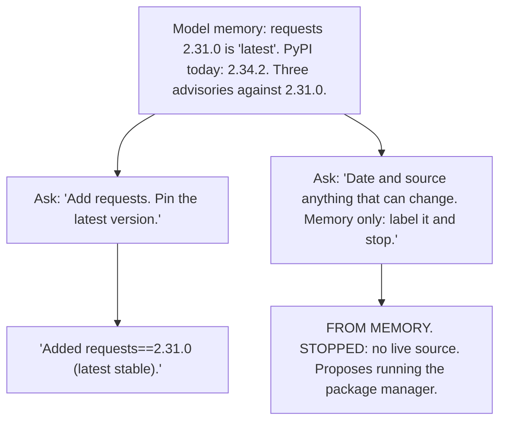

# Day 7 — Stale Certainty

**Time:** ~15 min

## What you'll learn

Day 6 was about trusting the model's account of what a tool printed. Today there is no tool. The model answers from memory: what it learned in training. **That memory stops at a cut-off date, and the model doesn't mark which facts have changed since.**

So "the latest version" means the latest one it read about. It says it in the present tense, with no date, and nothing errors when it's wrong.

Today you watch one dependency get pinned that way. Pinning means locking a dependency to one exact version (`requests==2.31.0`) so every install gets the same code. Then you change the ask so anything that can change needs a date and a live source. Last, you let an audit against today's advisory data decide whether a version is safe, so memory can't.

## See it

Same question. Same model. Only the ask changes.




```text
Memory: requests 2.31.0 "latest"     PyPI, 9 Oct 2026: requests 2.34.2

"Add requests.                       "Date and source anything that
 Pin the latest version."             can change. Memory only: stop."
-> "requests==2.31.0                 -> "FROM MEMORY: 2.31.0.
    (latest stable)."                    STOPPED: no live source."
```

## Story

The refunds service needs to call the payment provider over HTTP. You ask your coding agent: *"Add requests to refunds/requirements.txt. Pin the latest version."*

The reply (illustrative; your model's numbers will differ):

```text
Added requests==2.31.0 to refunds/requirements.txt (the latest
stable release). Pinned for reproducible builds.
```

It installs. It imports. The tests pass. You merge.

2.31.0 shipped in May 2023 and stopped being the latest in May 2024. On 9 Oct 2026 PyPI's newest is 2.34.2. An audit against today's advisory data says this about the pin (output trimmed to the distinct advisories):

```text
$ pip-audit -r refunds/requirements.txt
Name     Version ID              Fix Versions
-------- ------- --------------- ------------
requests 2.31.0  PYSEC-2026-1873 2.32.0
requests 2.31.0  PYSEC-2026-1872 2.32.4
requests 2.31.0  PYSEC-2026-2275 2.33.0
```

Exit code 1. One of those, CVE-2024-47081, can leak `.netrc` credentials to a third party through a crafted URL. On a service that holds payment credentials.

"Latest stable" was true once, for about a year. The model said it as if it were true today.

That is **stale certainty**: a fact that was true at training time, stated in the present tense, with no date and no source. Nothing in the reply tells you it's from 2023.

**Same question, different ask.** New chat, same model. This time the agent works under the [Ask first template](#ask-first): today's date is in the prompt, anything that can change needs `as of <date>` and a source, and memory alone means stop. The reply (illustrative):

```text
FROM MEMORY: 2.31.0 is the newest requests I know of. My training
data has a cut-off, so this may be out of date.
STOPPED: no live source. Proposed: run `pip install requests`
and pin the version `pip freeze` reports.
```

Same model, same memory. The only change: a claim about "now" needed a date, and stopping was allowed.

## Why it happens

1. **The weights are a snapshot.** A model learns from text collected up to a cut-off date, then is frozen. It is released months later and used for a year or more after that. Nothing it learned updates itself.

2. **It can't see a calendar.** Unless the harness puts today's date in the prompt, the model doesn't know it. "Latest" gets resolved against the newest thing in its training data, not against today.

3. **Its "latest" is often older than its cut-off.** A version released just before the cut-off appears in few documents. Its predecessor was written about for a year. The next-word prediction (Day 1) favors what was written most: the older version.

4. **The training text was in the present tense.** Blog posts said "the latest version is 2.31.0" when that was true. The model repeats the sentence and the tense, without the date the post had.

5. **Stale fails silently.** An old version installs, imports, and passes your tests. Unlike Day 6's wrong path, nothing exits non-zero. The problem lives in advisory databases and changelogs, which your test suite never reads.

**Trap in one line:** the model's "latest" is the latest it read about, and it can't tell you when that was.

**Not useful fixes:** "Make sure you're up to date." The model can't check without a source; it will just sound more sure. "Use a newer model." A later cut-off moves the problem a few months; the gap reopens the day after release. "I'll check PyPI by hand." Not across 200 dependencies, every week. That's what an audit is for.

## Rule

**Anything that can change since training needs a date and a live source. Get versions from the package manager, not memory, and let an audit against today's data decide "safe."**

Day 1: finished-sounding is not verified. Day 2: complete-looking is not decided by you. Day 3: agreed earlier is not still in force. Day 4: remembered is not obeyed. Day 5: agreed with is not confirmed. Day 6: reported is not observed. Day 7: **known then is not true now.**

## Ask first

The first ask let "latest" come from memory with no date. The second made every claim about "now" carry a date and a source, and made stopping a normal answer.

These moves make stale answers rarer and easier to spot. They don't make them impossible, so you still check.

**Practice workout:** [as-of-or-stop](./practice/day-07-as-of-or-stop/SKILL.md) — the same template plus the audit and CI checks. Customize it; it is a workout prompt, not a main repo skill.

1. **Give it today's date and what's installed.** *"Today is 2026-10-09. Installed versions are in the lockfile below."*
   **Why this helps:** The model can't see a calendar or your environment. With both in the prompt, "latest" and "current" have something real to anchor to.

2. **Date and source every claim that can change.** *"For versions, prices, limits, API behavior, and who holds a role, write: as of <date>, source: <tool output or URL>."*
   **Why this helps:** In the story, "latest stable" had neither. A required date makes a 2023 fact show its age; a required source makes a missing one obvious.

3. **Memory is a label, not an answer.** *"If your only source is training data, write FROM MEMORY and don't act on it."*
   **Why this helps:** It splits "I read this once" from "I checked this today." FROM MEMORY is a fixed string you can search for.

4. **Look it up or stop.** *"If you have a lookup tool, run it and quote the output (Day 6). If not, write STOPPED: no live source."*
   **Why this helps:** Without it, the only way to finish "pin the latest" is to type a number. STOPPED is an honest third way.

5. **Never type a version number.** *"Add dependencies with the package manager and report the version it installed. Don't write version numbers from memory."*
   **Why this helps:** `pip install requests` asks PyPI today. The resolver can't be stale; the model's memory always can be.

**Copy-paste template** (put it in the agent's standing instructions, or paste it before the task):

```text
Today is [YYYY-MM-DD]. Installed versions: [paste lockfile or
"pip freeze"].
1. For anything that can change over time (versions, prices,
   limits, API behavior, people in roles), write:
   as of <date>, source: <tool output or URL>
2. If your only source is training data, write FROM MEMORY.
   Don't act on it.
3. If you have a lookup tool, run it and quote the output.
   If not, write STOPPED: no live source. You may propose
   one lookup.
4. Add dependencies with the package manager. Report the version
   it installed. Never type a version number from memory.
```

**Limit:** This makes stale claims rarer. It doesn't stop them: the model can attach today's date to a remembered fact, or label a remembered fact as looked up. A date it writes is still text it wrote. That is why you still check.

## Then check

Don't judge a version by what the model called it. Check it against today's data, and let a script decide what a script can decide.

1. **Flag undated "latest" claims.** Save the reply as `reply.txt`. This prints any line that says latest, current, or newest with no `as of <year>` and no FROM MEMORY label, and fails if there is one:

   ```bash
   # Fail if a "latest/current/newest" claim has no date or label
   ! grep -nEi '\b(latest|current|newest|up to date)\b' reply.txt \
     | grep -viE 'as of [0-9]{4}|FROM MEMORY'
   ```

2. **Audit the lockfile against today's advisories.** Pin every dependency, including the ones your dependencies pull in (`pip freeze > requirements.txt`, or pip-compile), and audit that:

   ```bash
   pip-audit -r requirements.txt
   ```

   It queries the live advisory database on every run, so a fresh machine needs no saved state and there is no number to maintain. Exit 0 means no known advisory today. Exit 1 means it found one, or couldn't reach the database: a network failure fails closed. Audit the lockfile, not a loose list: an unpinned `requests` can resolve to different sub-dependencies on different days.

3. **Let CI decide, on every PR and every night.** Require the audit on PRs, and also run it on a schedule (GitHub Actions `schedule:`). Advisories land after you merge; the nightly run catches those without anyone touching the code. Multi-module repo or mixed stacks? `osv-scanner scan source -r .` finds every lockfile under the repo (PyPI, npm, Maven, Go, and more) and audits all of them in one run. It only recognizes standard names (`requirements.txt`, `package-lock.json`, `go.sum`, ...). Exit 1 on findings, 128 if it found no lockfile at all, so a renamed or missing lockfile never passes. An advisory that doesn't affect you gets an explicit ignore in a reviewed commit, with the reason: `--ignore-vuln <ID>` for pip-audit, an `[[IgnoredVulns]]` entry in `osv-scanner.toml`.

   Don't gate on "is this the newest version." That changes every release and the gate flakes. "Has a known advisory" changes only when the risk does.

4. **If you build the agent, inject the date and the lockfile.** Put today's date and the current lockfile in the system prompt on every run, and give the agent a version-lookup tool. It can't reason about a present it never sees.

**In short:** the model's "latest" is a memory. Date it, source it, and let an audit against today's advisories decide "safe."

## 10-minute exercise

**Setup:** Any chat model for steps 1–4. Step 5 needs Python 3 and network access.

1. **Latest.** New chat, no tools: *"What is the latest version of Python's requests library? Pin it for me."* Log its answer, then run `pip index versions requests` and log the real one.
2. **Today.** Same chat: *"What is today's date?"* Log: said it can't know, or gave a date as fact.
3. **Current.** New chat: *"What's the current stable release of Python?"* Log: dated and sourced, or undated present tense.
4. **Replay with the template.** New chats. Paste the **copy-paste template** first, then repeat steps 1 and 3. Run the grep from **Then check** on each reply. Log: FROM MEMORY / STOPPED, or an undated "latest."
5. **Run the audit.** Two virtual environments, so the audit tool stays out of your lockfile:

   ```bash
   python3 -m venv tools && tools/bin/pip install -q pip-audit
   python3 -m venv app && app/bin/pip install -q requests
   app/bin/pip freeze > requirements.lock
   echo 'requests==2.31.0' > requirements.txt
   tools/bin/pip-audit -r requirements.txt    # the model's pin
   tools/bin/pip-audit -r requirements.lock   # the resolver's pick today
   ```

   Log both results and exit codes (`echo $?`).
6. **Keep both.** Put the template in your agent's standing instructions and the audit in CI, on PRs and nightly.

If step 1 already said it can't know the latest version, good. Log it. Your model passed this question. Keep the template and the audit anyway; another package, another model, or next year may not.

**Done when:** you have logged latest, today, and current, a logged replay with the template, **and** both audit results: the 2.31.0 pin exits 1 with advisories listed, and the lockfile shows `No known vulnerabilities found` (if it doesn't, a new advisory landed: that's the audit doing its job).

## Carry to next day

| Keep this | Day 8 builds on it |
|-----------|-------------------|
| Log one line: `stale \| <claim> \| model said: <value> \| as of today: <value + source>` | Day 7 closes the failures week: the model's memory beat today's data. Day 8 opens guardrails: write the pass/fail checks before you prompt |
| Log one ask line: `ask \| as-of-or-stop template \| <FROM MEMORY or STOPPED / undated claim>` | A dated, sourced claim is the input a spec can check |
| Log one verify line: `verify \| pip-audit or osv-scanner \| <clean / advisory found>` | The audit is already a pass/fail check you wrote before the model answered |
| "The model says it's the latest" is a **memory to date**, not a fact | |

## Check yourself

Close the page. Answer without looking:

1. Why does a model state an old fact in the present tense, with no date?
2. Why is a model's "latest" often older than its own training cut-off?
3. Why gate on known advisories and not on "is this the newest version"?
4. Name **one Ask first tip** and **one Then check tip** you could use today.

Stuck on any → re-read **Why it happens**, **Ask first**, and **Then check** once → answer again. Being able to say it back is the bar — not "I get it."

(The practice skill `as-of-or-stop` uses the same template. Its Part B covers the grep, the lockfile audit, CI on PRs and nightly, and injecting the date in code.)
