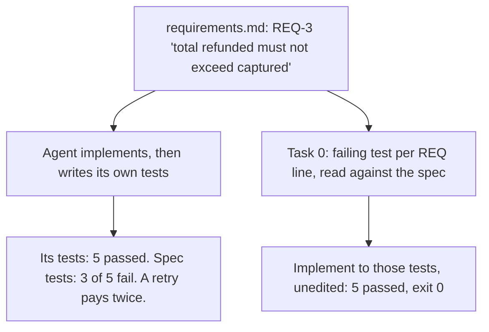

# Day 8 — A Spec Line Is Not a Check

**Time:** ~15 min

## What you'll learn

Days 1–7 were failures: ways a model's answer goes wrong while sounding right. Day 8 opens the guardrails week: mechanisms that block those paths.

You probably already work from a spec: a `requirements.md`, a design, a `tasks.md`, the way Kiro and spec-kit lay it out. The agent reads it, plans tasks, implements, writes tests, and goes green. **But a spec line is prose. Something still has to decide what it means in code, and if nobody else does, the agent does, once, inside its own implementation and its own tests.**

Today you watch a correct spec get implemented wrong with every test green. Then you add one task to the top of `tasks.md` that turns each spec line into a failing test before any code is written, read those tests against the spec, and let CI hold both together.

## See it

Same spec. Same agent. Only what counts as "done" changes.




## Story

The refunds service gets a feature. You do what you always do: paste the ticket into a spec, and the spec has five acceptance criteria, each with an ID:

```text
- REQ-1: A refund records its amount and adds it to the payment's refunded total.
- REQ-2: The refund amount must be greater than zero.
- REQ-3: Partial refunds are allowed; the total refunded must not exceed the captured amount.
- REQ-4: Refunds are issued in the payment's currency.
- REQ-5: A retry with the same idempotency key must not create a duplicate refund.
```

An idempotency key is an ID the caller sends with a request so that sending it twice, say after a timeout, has the effect of sending it once.

The agent reads the spec, plans tasks, implements `create_refund`, and writes tests. Its code (illustrative of what agents produce; this exact code is what we ran):

```python
def create_refund(payment, amount, currency, idempotency_key, ledger):
    if amount <= 0:                                    # REQ-2
        raise RefundError("Refund amount must be positive")
    if amount > payment["captured"]:                   # REQ-3
        raise RefundError("Refund exceeds captured amount")
    refund = {"payment_id": payment["id"], "amount": amount,
              "currency": payment["currency"],         # REQ-4
              "key": idempotency_key}
    ledger[idempotency_key] = refund                   # REQ-5: one entry per key
    payment["refunded"] += amount                      # REQ-1
    return refund
```

Every line cites a requirement. Its tests, one per REQ line, report `5 passed`. You merge.

Now test what the business meant. Payment: 10000 cents captured, EUR.

```text
$ pytest -q tests/test_refund_spec.py
FAILED test_two_partials_cannot_exceed_captured - Failed: DID NOT RAISE RefundError
FAILED test_other_currency_rejected - Failed: DID NOT RAISE RefundError
FAILED test_retry_refunds_once - AssertionError: ... 12000 == 6000
3 failed, 2 passed in 0.02s
```

(Output trimmed to the summary lines.)

Each failure is a reading of a correct spec line:

- **REQ-3:** "must not exceed" became "one refund can't exceed." Its test refunds 20000 once. Two refunds of 6000 both go through.
- **REQ-4:** "issued in the payment's currency" became "stamp it EUR." A 1000 USD request is quietly paid as 1000 EUR. Its test checks the label, and the label is right.
- **REQ-5:** "no duplicate refund" became "no duplicate ledger entry." The ledger has one entry; the customer got 12000 on a 10000 payment.

The spec was right. The tests were green. The check was the agent's reading of the spec, written by the same pass that wrote the code.

**Same spec, one task added.** Task 0 in `tasks.md`: write failing tests per REQ line, each naming its ID; don't implement. You read those five tests next to the five spec lines before task 1 starts. REQ-3's test says "6000, then 6000"; REQ-5's checks the refunded total, not the ledger. Then the agent implements against tests it can't edit (illustrative reply):

```text
$ pytest -q tests/test_refund_spec.py
.....
5 passed in 0.02s
Exit code 0. tests/test_refund_spec.py unchanged.
```

## Why it happens

1. **Prose has more than one correct reading.** "Total refunded must not exceed captured" is clear to the person who wrote it. To a reader it fits "per refund" and "cumulative." The agent picks the reading that matches the code it has seen most (Day 2's gap-filling), and it doesn't flag that it picked.

2. **The agent grades its own reading.** Implementation and tests come from the same interpretation in the same session. A test can't disagree with the code when both came from the same reading: `5 passed` meant "the code does what the agent understood."

3. **The tests look traceable.** Each test names a requirement, so the PR looks covered. Traceability shows *a* test exists per line, not that it tests what the line means.

4. **Review starts from the code.** Every branch carries a REQ comment that matches the spec in words. Missing behavior has no line to point at: there's no cumulative sum to review.

5. **Specs drift from tests.** Someone loosens a test to unblock a merge, or adds REQ-6 with no test. The spec says one thing; CI checks another.

**Trap in one line:** a spec tells the agent what to build; only a test tells anyone what it built.

**Not useful fixes:** "Write a more detailed spec." Longer prose has more readings, not fewer. "Ask the agent to double-check against the spec." Same reader, same reading. "Make it write more tests." More tests of the same reading still pass.

## Rule

**Turn every spec line into a failing test before implementation, read them against the spec, and let CI hold the two together.**

Day 1: finished-sounding is not verified. Day 2: complete-looking is not decided by you. Day 3: agreed earlier is not still in force. Day 4: remembered is not obeyed. Day 5: agreed with is not confirmed. Day 6: reported is not observed. Day 7: known then is not true now. Day 8: **a spec line is not a check.**

## Ask first

Your spec stays as it is. You add one task at the top and change what "done" means for the rest.

These moves make a wrong reading show up before code, where it's cheap. They don't make wrong readings impossible, so you still check.

**Practice workout:** [spec-line-tests](./practice/day-08-spec-line-tests/SKILL.md) — the same template plus the checks below. Customize it; it is a workout prompt, not a main repo skill.

1. **Give every acceptance criterion an ID.** `REQ-1`, `REQ-2`, … in `requirements.md`.
   **Why this helps:** An ID is something a test, a commit, and a script can all point at. Prose can't be grepped.

2. **Task 0 writes tests, not code.** Put it at the top of `tasks.md`: *"Write failing tests in tests/test_refund_spec.py, at least one per REQ line, each docstring starting with its REQ ID. Do not implement."*
   **Why this helps:** The agent's reading of each line now exists on its own, before code can make it look right.

3. **Each test states input and expected result.** *"REQ-3: 6000, then 6000 on 10000 -> 2nd raises; refunded = 6000."*
   **Why this helps:** You can read the test next to the spec line in seconds and see whether it tests "per refund" or "cumulative."

4. **Implementation can't touch the spec tests.** *"Done means tests/test_refund_spec.py passes, exit 0. Don't edit it. If a test looks wrong, write SPEC QUESTION and stop."*
   **Why this helps:** Editing a test until it passes is a known agent failure. A stop turns "the test is wrong" into a spec question for you.

5. **Unclear lines become questions.** *"If a REQ line has more than one reading, write AMBIGUOUS: REQ-n, both readings. Don't pick."*
   **Why this helps:** That's where the next spec fix comes from: a line you clarify, not a bug report.

**Copy-paste prompt** (use it for task 0; use lines 3–5 again for every implementation task):

```text
Spec: specs/refunds/requirements.md   Tasks: specs/refunds/tasks.md
Task 0 only. Do not implement.
1. Write tests/test_refund_spec.py: at least one test per REQ line.
   Each docstring starts with the REQ ID, then input -> expected result.
2. Test the edges the line implies (repeats, totals, other currencies,
   retries), not just one happy case. Run them; all must fail on the stub.
3. If a REQ line has more than one reading, write AMBIGUOUS: REQ-n,
   both readings. Don't pick one.
4. In later tasks, done means tests/test_refund_spec.py passes (exit 0).
   Don't edit it. If a test looks wrong: SPEC QUESTION: <test> - <why>, stop.
5. Report the command, its exit code, and its output (Day 6).
```

**Limit:** The tests are still a reading, now one you reviewed. They cover only the cases someone thought of; the code can pass all five and still log card numbers. Same key, different amount? None of the five says; payment APIs commonly reject it (Stripe does). If it matters, it's REQ-6 and a test.

## Then check

Don't score the PR on the agent's tests. Score it on tests that came from the spec, and make CI keep the spec and those tests in step.

1. **Read tests against the spec, side by side.** Five REQ lines, five docstrings. For each, ask: would the wrong reading also pass this? A REQ-3 test with one refund would. This is the step that catches a misreading.

2. **Prove they bite.** Run them on the stub before task 1: `pytest -q tests/test_refund_spec.py` must give `5 failed`, exit 1. A test that passes against `raise NotImplementedError` checks nothing.

3. **Lock the tests to the spec.** In CI, fail any PR that changes the spec tests without changing the spec:

   ```bash
   #!/usr/bin/env bash
   # spec_lock.sh: the spec tests may change only in a PR that also changes the spec.
   set -euo pipefail
   base=${1:-origin/main}
   changed=$(git diff --name-only "$base"...HEAD)
   if grep -qx 'tests/test_refund_spec.py' <<<"$changed" &&
      ! grep -qx 'specs/refunds/requirements.md' <<<"$changed"; then
     echo "SPEC LOCK FAILED: spec tests changed, requirements.md did not"; exit 1
   fi
   echo "Spec lock OK."
   ```

   Add both paths to `CODEOWNERS` (a file naming who must review changes to which paths) and turn on "Require review from Code Owners", so a change to either needs an owner's approval.

4. **Every REQ line has a test.** Fail CI if an ID in the spec appears in no test:

   ```bash
   #!/usr/bin/env bash
   # spec_coverage.sh: fail if any REQ ID in the requirements has no spec test naming it.
   set -euo pipefail
   req=specs/refunds/requirements.md
   tests=tests/test_refund_spec.py
   missing=$(comm -23 <(grep -oE 'REQ-[0-9]+' "$req" | sort -u) \
                      <({ grep -oE 'REQ-[0-9]+' "$tests" || true; } | sort -u))
   if [ -n "$missing" ]; then
     echo "SPEC COVERAGE FAILED: no test for" $missing; exit 1
   fi
   echo "Spec coverage OK: every REQ line has a test."
   ```

   It checks that a test exists, not that it's right. Step 1 does that.

**In short:** spec line → failing test with its ID → read side by side → code to it → CI keeps them together.

## Fit it into your workflow

You already have the spec, tasks, agent, and CI. This adds one task, one prompt, and two CI scripts:

- **`tasks.md`:** task 0 at the top, *"Write failing tests per acceptance criterion, tagged with REQ IDs. Do not implement."* Implementation tasks start only after you've read them against the spec.
- **Your AI tool** (Cursor, Claude Code, Copilot, Kiro, any of them): paste the copy-paste prompt for task 0; keep lines 4–5 in your project rules so every later task inherits them.
- **CI, on every PR:** `pytest tests/test_refund_spec.py`, `scripts/spec_coverage.sh`, `scripts/spec_lock.sh`. "Done" is decided there, not in the chat.

**On a big requirement**, the same loop runs per slice:

1. **Slice it** into testable pieces (create refund, refund webhook, refund report). Each slice gets its own task 0 just before its implementation tasks.
2. **Untestable criteria** ("refunds feel fast") go on an open-questions list for a human, not into a test the agent invents.
3. **Earlier slices' spec tests keep running** on every new slice, so new code can't quietly break agreed behavior.
4. **Spec and spec tests change together**, in one reviewed commit, or CI fails.

## 10-minute exercise

**Setup:** Python 3 with pytest, git, and your usual AI coding tool.

1. **Write three REQ lines** for a function you need this week, or use REQ-3 to REQ-5 above. One must cover a total, a repeat, or a retry.
2. **Let the agent do it its usual way.** Paste the spec; ask it to implement and test. Log: its pass count.
3. **Task 0, new session.** Paste the **copy-paste prompt**. Read each test next to its REQ line. Log any test the wrong reading would also pass, and any AMBIGUOUS line.
4. **Score step 2's code on step 3's tests.** Log: how many failed, and which reading the agent picked.
5. **Run both gates.** Delete one REQ ID from the tests and run `spec_coverage.sh`; commit a test edit without a spec edit on a branch and run `spec_lock.sh main`. Log: both exit 1.

If step 4 passed everything, log it: the agent's reading matched yours this time. Keep the tests; the next model may read it differently.

**Done when:** you have spec tests that failed on the stub, a logged score of the agent's own-way code against them, **and** both gates logged failing on purpose.

## Carry to next day

| Keep this | Day 9 builds on it |
|-----------|-------------------|
| Log one line: `spec \| <function> \| own tests: <n> passed \| spec tests: <n> failed \| misread: REQ-<n>` | Day 8: a test says what a spec line means. Day 9: a refusal criterion says when to stop instead of producing anything |
| Log one ask line: `ask \| task 0 prompt \| <AMBIGUOUS / SPEC QUESTION / none>` | AMBIGUOUS and SPEC QUESTION are refusals already: named conditions where stopping is right |
| Log one verify line: `verify \| side-by-side + coverage + lock \| <caught / clean>` | A gate that can't fail is like a refusal that never trips; Day 9 tests both the same way |
| "Every test is tagged and green" is **the agent's reading**, not a check | |

## Check yourself

Close the page. Answer without looking:

1. Why can a correct spec produce wrong code with every test green?
2. Why don't tests the agent writes alongside its code catch its misreading?
3. What does the spec-ID coverage gate prove, and what does it not prove?
4. Name **one Ask first tip** and **one Then check tip** you could use today.

Stuck on any → re-read **Why it happens**, **Ask first**, and **Then check** once → answer again. Being able to say it back is the bar — not "I get it."

(The practice skill `spec-line-tests` uses the same prompt. Its Part B covers the side-by-side read, the stub run, and both CI gates.)
