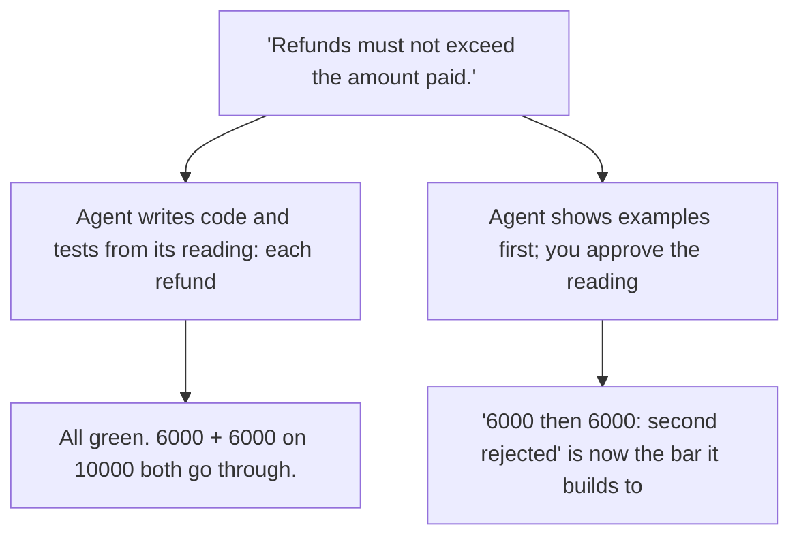

# Day 8 — Self-Graded Green

**Time:** ~15 min

## What you'll learn

Days 1–7 showed seven ways AI work goes wrong. Look back and they share one move: you judged the work by its own account. Its confident claim, its summary of a tool run, its memory of what's "latest." Part 2 is about stopping that. The first guardrail is the simplest to state: **decide what "right" means before the agent works, so its output is judged against your standard, not its own.**

Today's case is the one that looks most like proof: tests. **When the same agent writes the code and the tests, it grades its own work. A wrong reading can't fail, because both sides share it. Green means the agent agrees with itself.** You'll see that happen on one refund rule, then break the loop by approving the agent's reading, as concrete examples, before it writes any code.

## See it

One requirement. The agent's reading and yours. Both could be fully tested.




```text
"Refunds must not exceed the amount paid."   Payment: 10000

Agent's test:   20000 once      -> rejected       pass
Your meaning:   6000, then 6000 -> 2nd rejected   never asked
Agent's code:   6000, then 6000 -> both paid      12000 out
```

## Story

You hand an agent a requirement from the refunds spec:

*"Refunds must not exceed the amount paid."*

It plans, implements, writes tests, and reports green. The core of its code (illustrative; this is the logic we ran):

```python
if amount > payment["paid"]:
    raise RefundError("Refund exceeds amount paid")
```

Its test refunds 20000 on a 10000 payment and expects a rejection. Pass. The code is clean, the test is real, the requirement is right. You approve.

You meant the total of all refunds. The agent read each refund on its own. Refund 6000, then another 6000, on that same 10000 payment: both go through. 12000 out on 10000 paid. No test failed, because no test could. The test was written from the same reading as the code.

That's the part to sit with. A missed default is Day 2's problem. Today's problem is what happens next: the misreading gets **certified**. The agent wrote the rule and the exam, then passed the exam. You read "tests pass" as evidence about your requirement. It was evidence that two outputs from one reader agree.

**What breaks the loop.** Make the reading visible before anything is built, in a form you can judge in seconds. Not prose, which hides the reading. Examples, which commit to one:

```text
Refunds must not exceed the amount paid. Payment: 10000.
- 4000, then 6000 -> both accepted; refunded 10000
- 6000, then 6000 -> second rejected; refunded 6000
- 10001 at once   -> rejected
```

The second line is where "each" and "total" split. Had the agent written "6000, then 6000 → both accepted," you'd have caught it in one glance, before any code existed. Approved, those lines become the standard the code is judged against, and they came from you.

## Why it happens

1. **One reader, two outputs.** Code and tests come from the same understanding in the same pass. A test can only disagree with code if it came from somewhere else.

2. **Tests look independent.** They're a separate file with separate asserts, so they feel like a second opinion. They're the first opinion, restated.

3. **The splitting case is the one nobody writes.** A single refund passes under both readings. Only a second refund separates them, and a reader who doesn't see the fork has no reason to write it.

4. **Green ends the review.** A passing suite moves your attention to style and structure. Missing behavior has no line in the diff to point at.

5. **Code is the slowest place to read intent.** Finding "per refund, not total" in an implementation takes suspicion and time. In an example it takes a glance.

**Trap in one line:** the agent's green proves its code matches its reading, and you never saw the reading.

**Not useful fixes:** "Write a more detailed spec." More prose, more readings. "Ask it to check its work against the spec." Same reader, same reading. "More tests." More tests of the same reading still pass. "Have a second agent write the tests." Better, but it can share the reading too, and you still never saw it.

## Rule

**Before the agent builds, approve its reading of each requirement as concrete examples. Judge the result against those, not its own tests.**

Day 1: finished-sounding is not verified. Day 2: complete-looking is not decided by you. Day 3: agreed earlier is not still in force. Day 4: remembered is not obeyed. Day 5: agreed with is not confirmed. Day 6: reported is not observed. Day 7: known then is not true now. Day 8: **self-graded is not passed.**

**In short:** approve the agent's understanding before you approve its code.

## Ask first

These moves make a wrong reading visible while it's still cheap. They don't make wrong readings impossible, so you still read the examples.

**Practice workout:** [self-graded-green](./practice/day-08-self-graded-green/SKILL.md) — the same prompt plus a checklist for reading the examples. Customize it; it is a workout prompt, not a main repo skill.

1. **Restate each requirement as concrete examples.** Input and expected result: *"6000, then 6000 on 10000 → second rejected; refunded 6000."*
   **Why this helps:** A sentence hides its reading. An example commits to one, and you can judge it in seconds.

2. **Ask for the cases where readings split.** Repeats, totals, boundaries, retries, not one happy case.
   **Why this helps:** "Each vs total" only shows with two refunds. One example passes under both readings.

3. **Make forks explicit.** *"If a requirement reads two ways, write TWO READINGS and show both."*
   **Why this helps:** The agent often sees the fork. This makes it say so instead of choosing quietly.

4. **Stop before code.** *"Don't write code until I approve the examples. After that, don't change them."*
   **Why this helps:** The approved examples become the bar. The agent's later tests check your reading, not its own.

**Copy-paste prompt** (paste with the requirement or spec):

```text
Before writing any code:
1. For each requirement, give 2-4 concrete examples:
   input -> expected result. Include repeats, totals,
   boundaries, and retries where they apply.
2. If a requirement reads two ways, write TWO READINGS:
   <requirement>, show an example of each, and don't pick.
3. Stop and wait for my approval.
After I approve: build to those examples, turn them into
tests, and don't change them. If one looks wrong, ask.
```

**Limit:** Examples cover only what someone thought of. Code can satisfy every one and still do something none mentions. And approving is a judgment call: skim the examples and you sign off on the wrong reading yourself.

## Fit it into your workflow

Your flow is already spec → plan → tasks → implement, in Kiro, Claude Code, Cursor, or similar. Add one step right after the spec: the agent writes examples per requirement and pauses for your approval. Approved examples become the definition of done that later tasks build to and can't change.

On a big requirement, do this per slice, just before that slice's tasks.

## 10-minute exercise

**Setup:** any AI coding tool and one requirement from your own work.

1. **Pick one spec line** your team wrote recently, ideally with a limit, total, repeat, or retry in it.
2. **Write your reading first.** Two or three examples, input → expected result, no chat open.
3. **Ask for the agent's.** New session. Paste the **copy-paste prompt** and the line.
4. **Compare.** Log any example where its expected result differs from yours, and any TWO READINGS it flagged.
5. **Check shipped code** (if the line is already built). Run your differing example against it, then look at whether any existing test covers it. Log: whose reading the code follows, and whether its tests would have noticed.

If every example matched, log it: this line had one reading for this model. Keep the examples; the next model may read it differently.

**Done when:** you have your examples, the agent's examples, **and** a logged line saying where they split or that they didn't.

## Carry to next day

| Keep this | Day 9 builds on it |
|-----------|-------------------|
| Log one line: `reading \| <spec line> \| mine: <example> \| agent's: <example>` | Day 8 set "right" before the work. Day 9 sets when the agent should refuse to work at all |
| Log one ask line: `ask \| examples-first prompt \| <TWO READINGS / mismatch / none>` | TWO READINGS and "wait for approval" are refusals already: named points where stopping is right |
| Log one verify line: `verify \| shipped code vs my example \| <my reading / agent's reading>` | Day 9 tests a refusal the same way: give it the input where it should stop |
| "All tests pass" is **the agent agreeing with itself**, not your pass | |

## Check yourself

Close the page. Answer without looking:

1. What did Days 1–7 have in common, and how does Day 8 change it?
2. Why can't the agent's own tests catch its misreading?
3. Why does "6000, then 6000" expose the misreading when "20000 once" doesn't?
4. Name **one Ask first tip** you could use on your next spec.

Stuck on any → re-read **What you'll learn**, **Story**, and **Ask first** once → answer again. Being able to say it back is the bar — not "I get it."

(The practice skill `self-graded-green` uses the same prompt, plus a short checklist for reading the examples.)
