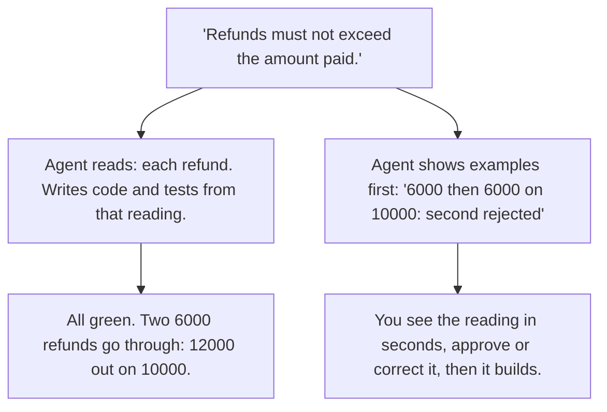

# Day 8 — A Spec Line Is Not a Check

**Time:** ~15 min

## What you'll learn

Days 1–7 were failures: ways a model's answer goes wrong while sounding right. Day 8 opens the guardrails week: mechanisms that block those paths.

**When the same agent writes the code and the tests, the tests check the agent's understanding, not yours.** Today you see why that makes "all green" the wrong signal, and the one step that fixes it: approve the agent's reading before it builds anything.

## See it

One requirement. Two readings. Both are fully tested.




```text
"Refunds must not exceed the amount paid."

Agent's tests:   20000 on 10000 -> rejected      pass
Your meaning:    6000, then 6000 on 10000 -> 2nd rejected
Agent's code:    both go through                  never tested
```

## Story

**1. The claim.** You give an agent a requirement. It writes the code, then the tests, and everything passes. Those tests don't check what you meant. They check what the agent understood, because the agent wrote both.

**2. Why.** Every written instruction has more than one reading. The person who wrote it sees one. A reader without that context sees several, and an agent is that reader. It picks one, usually the most common shape in code it has seen, and it doesn't tell you it picked (Day 2's gap-filling).

**3. The consequence.** The code follows the reading. The tests follow the same reading. So they agree, and everything passes. **Green means the agent agrees with itself.** It says nothing about whether the reading was yours.

**4. One small example.** The requirement: *"Refunds must not exceed the amount paid."*

Each refund, or the total of all refunds? You meant the total. The agent reads it as each one (illustrative; this is the logic we ran):

```python
if amount > payment["paid"]:
    raise RefundError("Refund exceeds amount paid")
```

Its test: refund 20000 on a 10000 payment, rejected. Pass. Now refund 6000, then 6000 again, on that same 10000 payment. Both go through. 12000 out on 10000 paid. No test failed, because no test asked.

Nothing here is sloppy. The code is clean, the test is real, the requirement was right. The check was the agent's reading of it.

**5. What breaks the loop.** You can't review a reading you never see. So make the agent show it before it builds, as concrete examples you can judge in seconds:

```text
Refunds must not exceed the amount paid. Payment: 10000.
- 4000, then 6000 -> both accepted; refunded 10000
- 6000, then 6000 -> second rejected; refunded 6000
- 10001 at once   -> rejected
```

The second line is where "each" and "total" split. Had the agent shown "6000, then 6000 → both accepted," you'd have caught it in one glance, before any code existed. Reading code to find the same thing takes far longer, and you'd have to already suspect it.

## Why it happens

1. **Prose underdetermines code.** "Must not exceed" fits a per-refund check and a running total. Both are correct English; only one is your business.

2. **Agents fill gaps silently.** Picking a reading is part of producing an answer. Saying "I picked" isn't, unless you ask for it.

3. **One reader, two outputs.** Code and tests come from the same pass, the same understanding. A test can't disagree with code when both came from the same reading.

4. **Green ends the review.** Passing tests feel like evidence about the requirement. They're evidence about consistency.

5. **Missing behavior has no line.** In review you read what's there. A running total that was never written has nothing to point at.

**Trap in one line:** the agent's tests prove its code matches its reading, and you never saw the reading.

**Not useful fixes:** "Write a more detailed spec." Longer prose has more readings, not fewer. "Ask the agent to check its work against the spec." Same reader, same reading. "Make it write more tests." More tests of the same reading still pass.

## Rule

**See the agent's reading of each requirement, as concrete examples, before it writes code.**

Day 1: finished-sounding is not verified. Day 2: complete-looking is not decided by you. Day 3: agreed earlier is not still in force. Day 4: remembered is not obeyed. Day 5: agreed with is not confirmed. Day 6: reported is not observed. Day 7: known then is not true now. Day 8: **a spec line is not a check.**

**In short:** approve the agent's understanding before you approve its code.

## Ask first

These moves make a wrong reading visible while it's still cheap. They don't make wrong readings impossible, so you still read the examples.

**Practice workout:** [spec-line-tests](./practice/day-08-spec-line-tests/SKILL.md) — the same prompt plus the checks below. Customize it; it is a workout prompt, not a main repo skill.

1. **Restate each requirement as concrete examples.** Input and expected result: *"6000, then 6000 on 10000 → second rejected; refunded 6000."*
   **Why this helps:** A sentence hides its reading. An example commits to one, and you can judge it in seconds.

2. **Cover where readings split.** Ask for repeats, totals, boundaries, and retries, not one happy case.
   **Why this helps:** "Each vs total" only shows up with two refunds. A single example passes under both readings.

3. **Flag lines with two readings.** *"If a requirement reads two ways, write TWO READINGS: <line>, then both."*
   **Why this helps:** The agent often sees the fork. This makes it say so instead of choosing quietly.

4. **Stop and ask instead of picking.** *"Don't write code until I approve the examples."*
   **Why this helps:** The approved examples become the definition of done, written in your reading, not the agent's.

**Copy-paste prompt** (paste before the requirement or spec):

```text
Before writing any code:
1. For each requirement, give 2-4 concrete examples:
   input -> expected result. Include repeats, totals,
   boundaries, and retries where they apply.
2. If a requirement reads two ways, write TWO READINGS:
   <requirement>, show an example of each, and don't pick.
3. Stop and wait for my approval.
After I approve: build to those examples, turn them into
tests, and don't change them. If one looks wrong, ask.
```

**Limit:** Examples cover only what someone thought of. The agent can satisfy every one and still do something no example mentions. Reading the examples is still a judgment call; skim them and you approve the wrong reading with a signature on it.

## Fit it into your workflow

Your flow is already spec → plan → tasks → implement, in Kiro, Claude Code, Cursor, or similar. Add one step right after the spec: the agent writes examples per requirement and pauses for your approval. Approved examples become the definition of done that later tasks build to and can't change.

On a big requirement, do this per slice, just before that slice's tasks.

## 10-minute exercise

**Setup:** any AI coding tool and one requirement from your own work.

1. **Pick one spec line** you or your team wrote recently. Prefer one with a limit, a total, a repeat, or a retry in it.
2. **Write your reading first.** Two or three examples, input → expected result, no chat open.
3. **Ask for the agent's.** New session. Paste the **copy-paste prompt** and the line.
4. **Compare.** Log any example where its expected result differs from yours, and any TWO READINGS it flagged.
5. **Check the old code** (if the line is already built). Run your differing example against it. Log: did it do your reading or the agent's?

If every example matched, log it: this line had one reading for this model. Keep the examples; the next model may read it differently.

**Done when:** you have your examples, the agent's examples, **and** a logged line saying where they split or that they didn't.

## Carry to next day

| Keep this | Day 9 builds on it |
|-----------|-------------------|
| Log one line: `reading \| <spec line> \| mine: <example> \| agent's: <example>` | Day 8: examples show what the agent will build. Day 9: a refusal criterion says when to build nothing |
| Log one ask line: `ask \| examples-first prompt \| <TWO READINGS / mismatch / none>` | TWO READINGS and "wait for approval" are refusals already: named points where stopping is right |
| Log one verify line: `verify \| old code vs my example \| <my reading / agent's reading>` | Day 9 tests a refusal the same way: give it the input where it should stop |
| "All tests pass" is **the agent agreeing with itself**, not a check | |

## Check yourself

Close the page. Answer without looking:

1. Why do tests the agent wrote pass even when it misread the requirement?
2. Why does "6000, then 6000" expose the misreading when "20000 once" doesn't?
3. Why are examples easier to review than the code that implements them?
4. Name **one Ask first tip** you could use on your next spec.

Stuck on any → re-read **Story** and **Ask first** once → answer again. Being able to say it back is the bar — not "I get it."

(The practice skill `spec-line-tests` uses the same prompt, plus a short checklist for reading the examples.)
