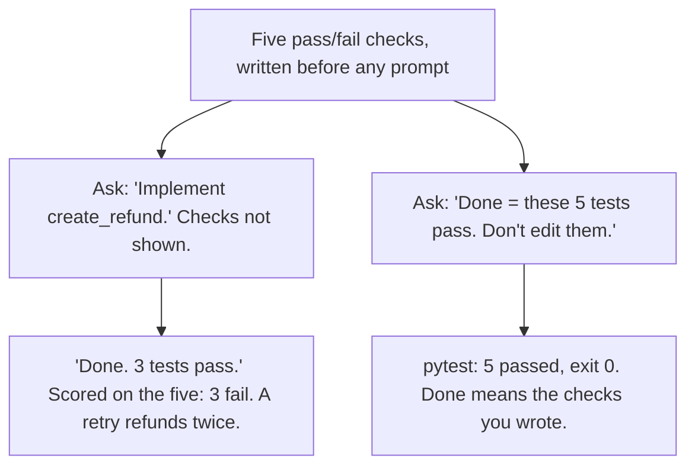

# Day 8 — Spec Before Prompt

**Time:** ~15 min

## What you'll learn

Days 1–7 were failures: ways a model's answer goes wrong while sounding right. Day 8 opens the guardrails week: mechanisms that block those paths. The first one goes in before you type the prompt.

Ask for code with no written checks and the model decides what "done" means. **It fills every rule you didn't state with the most common version it has seen, and stops when the answer looks finished.** You find your real rules later, in review or in production.

Today you watch one function get written that way. Then you write five pass/fail checks first, so "done" means those checks pass. Last, you make the checks prove they can fail, and lock them so the agent can't edit them to pass.

## See it

Same function. Same model. Only the order changes.




```text
Written first: 5 checks (input -> expected result)

"Implement create_refund."            "Make these 5 tests pass.
                                       Don't edit them."
-> "Done. 3 tests pass."              -> "5 passed, exit 0."
   Scored on the five: 3 failed.         Scored on the five: 5 passed.
```

## Story

The refunds service has a stub: a placeholder with the real signature and no logic. The signature and one-line docstring are all the spec there is:

```python
def create_refund(payment, amount, currency, idempotency_key, ledger):
    """Refund part or all of a captured payment. Amounts in cents."""
    raise NotImplementedError
```

An idempotency key is an ID the caller sends with a request so that sending it twice, after a timeout, has the effect of sending it once. You ask your agent: *"Implement create_refund in refunds/refund.py and add tests."*

The reply (illustrative; your model's code will differ):

```python
def create_refund(payment, amount, currency, idempotency_key, ledger):
    """Refund part or all of a captured payment. Amounts in cents."""
    if amount <= 0:
        raise RefundError("Refund amount must be positive")
    if amount > payment["captured"]:
        raise RefundError("Refund exceeds captured amount")
    refund = {"payment_id": payment["id"], "amount": amount,
              "currency": currency, "key": idempotency_key}
    ledger[idempotency_key] = refund
    payment["refunded"] += amount
    return refund
```

Three tests come with it: refund 5000 of 10000, refund 0, refund 20000. `3 passed`. It reads clean. You merge.

Now score it against what the business needed, written as checks. Payment: 10000 cents captured, EUR, nothing refunded yet.

```text
1. Refund 4000 EUR (key k1)         -> refund of 4000; refunded = 4000
2. Amount 0, then -1                -> RefundError each time; refunded = 0
3. 6000 (k1), then 6000 (k2)        -> second raises RefundError; refunded = 6000
4. 1000 USD on the EUR payment      -> RefundError; refunded = 0
5. 6000 EUR with key k1, twice      -> second returns the first refund; refunded = 6000
```

Those five, as a pytest file, run against the agent's code:

```text
$ pytest -q tests/test_refund_spec.py
FAILED test_total_cannot_exceed_captured - Failed: DID NOT RAISE
FAILED test_currency_must_match - Failed: DID NOT RAISE
FAILED test_same_key_refunds_once - AssertionError: ... 12000 == 6000
3 failed, 2 passed in 0.02s
```

(Output trimmed to the summary lines.)

Exit code 1. Two partial refunds can pay out more than was captured. A dollar refund goes against a euro payment. And the client retry the idempotency key exists for refunds the customer twice: 12000 out on a 10000 payment.

None of that is a bug the model introduced against a rule. There was no rule. It filled each gap with the common shape of refund code and stopped when it looked done.

**Same function, checks first.** New chat. This time you paste the five checks and the test file under the [Ask first template](#ask-first) before asking. The reply (illustrative):

```text
$ pytest -q tests/test_refund_spec.py
.....
5 passed in 0.01s
Exit code 0. tests/test_refund_spec.py unchanged.
```

Same model. The only change: "done" was written down before the code was.

## Why it happens

1. **A vague ask has many right-looking answers.** "Implement create_refund" fits hundreds of functions. The model picks a likely one: the refund code it has seen most, not your business's rules (Day 2's gap-filling).

2. **"Looks finished" is the only finish line.** With no checks in the prompt, nothing says when the job is done. The model stops when the text looks like a complete answer, and a complete answer looks the same whether it handles retries or not.

3. **Its tests check its own guesses.** Tests written from the code test what the code does. The same gaps sit on both sides, so they agree: `3 passed` here meant "the code does what the code does."

4. **You review after you've seen the answer.** Finished-looking code steers review toward what's on the screen. Missing behavior has no line to point at: there's no retry handling to read.

5. **Rules found late cost the most.** Found in review, a missing rule is a rewrite. Found in production, it's money already sent.

**Trap in one line:** with no checks written first, "done" means "looks done," and the model decides what that looks like.

**Not useful fixes:** "Handle all edge cases." It sounds like a spec but nothing can fail it; the model picks the edge cases. "Have the model write the spec." You get a likely spec with the same guesses. Let it propose cases; you decide which become checks. "Review harder." You can't review code that was never written.

## Rule

**Write the pass/fail checks before you prompt. Done means they pass, not that the answer looks finished.**

Day 1: finished-sounding is not verified. Day 2: complete-looking is not decided by you. Day 3: agreed earlier is not still in force. Day 4: remembered is not obeyed. Day 5: agreed with is not confirmed. Day 6: reported is not observed. Day 7: known then is not true now. Day 8: **judged after is not specified before.**

## Ask first

The first ask left "done" to the model. The second fixed it in advance, as checks the model could read but not change.

These moves make invented requirements rarer and easier to spot. They don't make them impossible, so you still check.

**Practice workout:** [spec-first](./practice/day-08-spec-first/SKILL.md) — the same template plus the checks below. Customize it; it is a workout prompt, not a main repo skill.

1. **Write each check as input and expected result.** *"6000, then 6000 on a 10000 payment: the second raises RefundError; refunded stays 6000."*
   **Why this helps:** A named input and an observable result is pass or fail for anyone, including a script. "Handles over-refunds" isn't.

2. **Write them before you prompt.** Five is enough to start. Include the case that costs money if wrong.
   **Why this helps:** Checks written after the answer drift toward what the answer does. Before, they can only come from what you need.

3. **Make the checks the finish line.** *"Done means every test in tests/test_refund_spec.py passes. Nothing else counts as done."*
   **Why this helps:** The model now has a stopping point outside its own text: an exit code.

4. **The checks are read-only.** *"Don't edit, skip, or delete those tests. If one looks wrong, write SPEC QUESTION and stop."*
   **Why this helps:** Editing a test until it passes is a known agent failure. Making it a stop turns "the test is wrong" into a question for you.

5. **Gaps are questions, not choices.** *"If the code must handle a case no check covers, write UNSPECIFIED: <case>. Don't pick a behavior."*
   **Why this helps:** That's how the next requirement shows up: as a line you answer before merging, not a bug report after.

**Copy-paste template** (paste the checks and test file with it, before the task):

```text
Spec: [paste the pass/fail checks]
Tests: [paste the test file, or give its path]
1. Done means every test in [test file] passes (exit code 0).
   Nothing else counts as done.
2. Don't edit, skip, or delete those tests. If one looks wrong,
   write SPEC QUESTION: <test> - <why> and stop.
3. If the code must handle a case no check covers, write
   UNSPECIFIED: <case>. Don't pick a behavior for it.
4. Report the command you ran, its exit code, and its output
   (Day 6). No summary in place of output.
```

**Limit:** Checks cover only what you thought of. The model can pass all five and still do something you never wrote down, such as logging card numbers. Same key, different amount? None of the five says; payment APIs commonly reject it (Stripe does). If it matters, it's check six. Code can also be bent to the exact test inputs. That is why you still read the diff.

## Then check

Don't score the answer on how finished it looks. Score it on the checks you wrote first, and make sure those checks can fail.

1. **Prove the checks bite, before any code.** Run them against the stub:

   ```bash
   pytest -q tests/test_refund_spec.py    # against the stub
   ```

   All five must fail (`5 failed`, exit 1). A check that passes against `raise NotImplementedError` checks nothing.

2. **Score on the checks only.** Run the same command on the agent's code. Exit 0 is done; anything else is not done, however clean it reads. Pytest exits 4 if the file path is wrong and 5 if it collects no tests (Day 6), so a moved or emptied file fails too.

3. **Lock the spec.** Before you score, confirm the agent didn't touch it:

   ```bash
   git diff --exit-code main -- tests/test_refund_spec.py
   ```

   Exit 1 means it changed. In the repo, list spec tests in `CODEOWNERS` (a file naming who must review changes to which paths) and turn on "Require review from Code Owners" in branch protection. Spec edits then need an owner's approval, and a PR that changes code and spec together shows it.

4. **Every miss becomes a check.** A rule you find in review or in production goes into the spec first. Run it, watch it fail, then fix the code. The suite grows from real misses, not guesses.

**In short:** write the checks, watch them fail, lock them, and let the exit code decide "done."

## 10-minute exercise

**Setup:** Python 3 with pytest, and any chat model.

1. **Write five checks.** No chat open. Use the `create_refund` stub above, or a small function you need this week. Write five lines: input, expected result. One must be a case that costs money or data if wrong.
2. **Make them tests and watch them fail.** Turn each into a pytest test against the stub. Run them. Log: all five failed, or which one passed against nothing (rewrite it).
3. **Prompt first.** New chat, no checks: *"Implement create_refund and add tests."* Run your five against its code. Log: how many passed, and which rule it invented differently from yours.
4. **Spec first.** New chat. Paste the **copy-paste template**, your checks, and the test file, then ask again. Run your five, then the `git diff` from **Then check**. Log: exit code, and any SPEC QUESTION or UNSPECIFIED lines.
5. **Keep what bit.** Every check the prompt-first code failed stays in your suite. Any UNSPECIFIED line gets an answer and becomes a check.

If step 3 already passed all five, good. Log it: your checks covered what the model guessed by default. Keep them anyway; the next function, model, or prompt may not guess the same.

**Done when:** you have five checks that all failed against the stub, a logged prompt-first score, **and** a logged spec-first run with its exit code and an unchanged test file.

## Carry to next day

| Keep this | Day 9 builds on it |
|-----------|-------------------|
| Log one line: `spec \| <function> \| prompt-first: <n>/5 passed \| missed: <rule>` | Day 8: a check says what passing looks like. Day 9: a refusal criterion says when to stop instead of producing anything |
| Log one ask line: `ask \| spec-first template \| <SPEC QUESTION / UNSPECIFIED / none>` | SPEC QUESTION and UNSPECIFIED are refusals already: named conditions where stopping is the right answer |
| Log one verify line: `verify \| stub run + git diff \| <all failed first / spec unchanged>` | A check that can't fail is like a refusal that never trips; Day 9 tests both the same way |
| "It looks done" is a **guess at your rules**, not a pass | |

## Check yourself

Close the page. Answer without looking:

1. Why does a model stop when code looks finished, not when it meets your rules?
2. Why do tests the model wrote from its own code pass even when the code is wrong?
3. Why must every check fail against the stub before you write any code?
4. Name **one Ask first tip** and **one Then check tip** you could use today.

Stuck on any → re-read **Why it happens**, **Ask first**, and **Then check** once → answer again. Being able to say it back is the bar — not "I get it."

(The practice skill `spec-first` uses the same template. Its Part B covers the stub run, scoring on the checks only, locking the spec, and turning misses into checks.)
